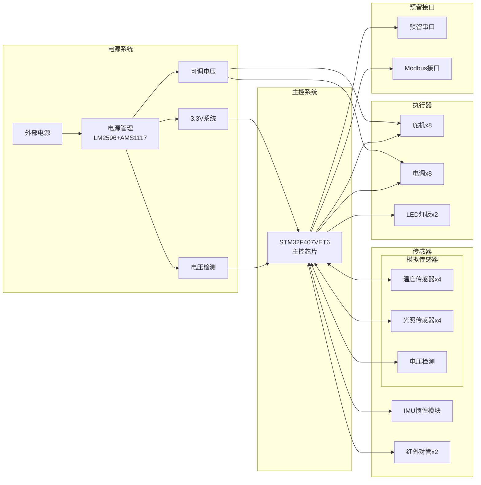
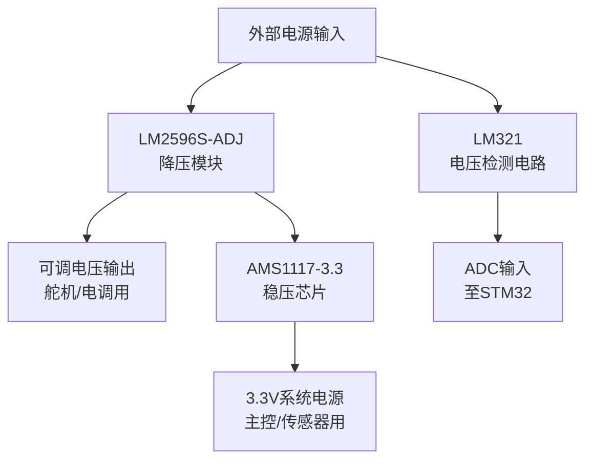
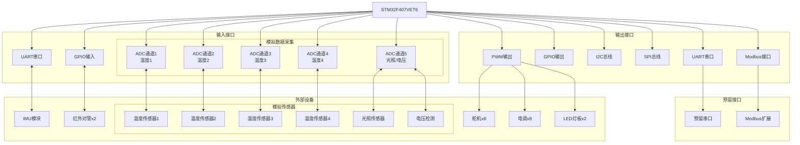
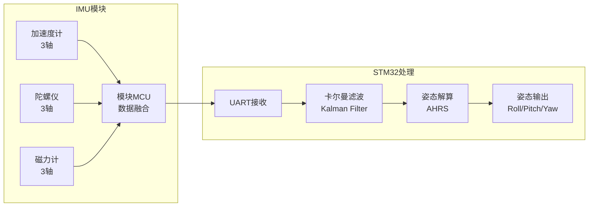
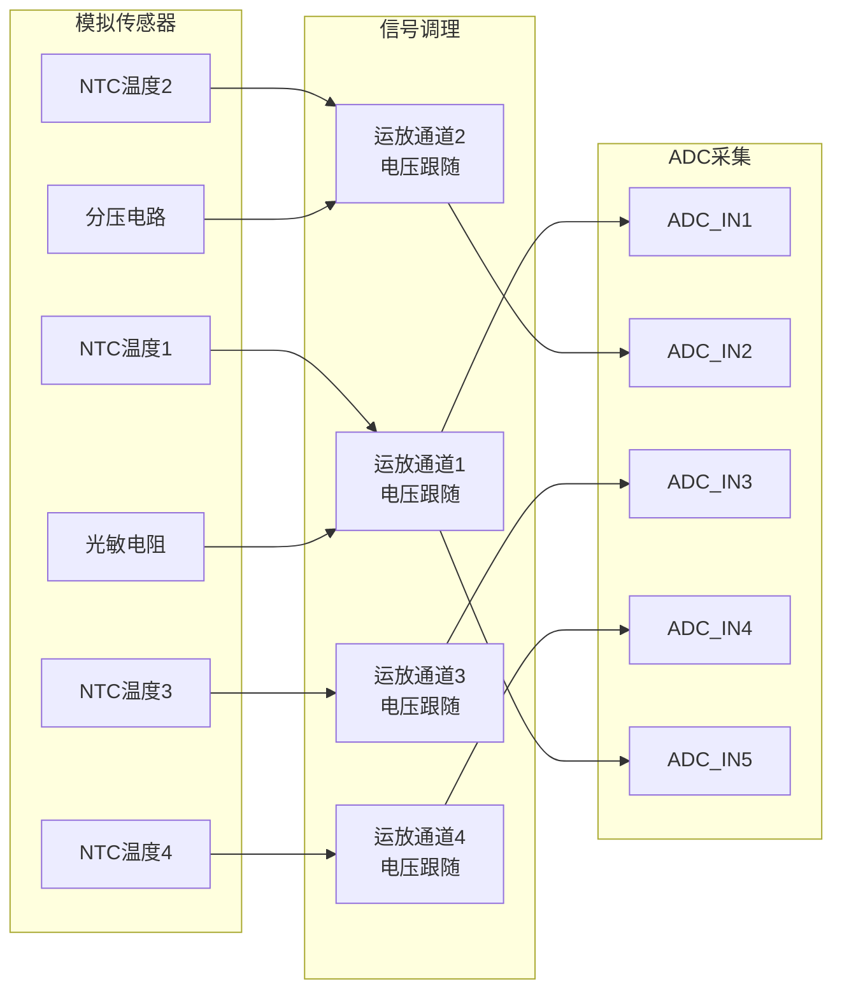
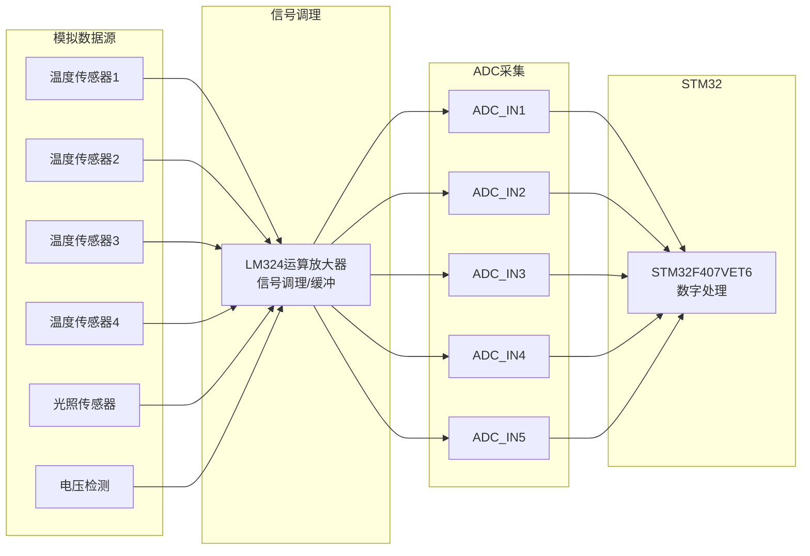

# 水下机器人硬件系统流程图

## 1. 系统总体架构

## 2. 电源系统详细

### 2.1 电源系统硬件介绍

#### LM2596S-ADJ 降压模块
- **类型**: DC-DC 开关降压稳压器
- **输入电压**: 4.5V - 40V
- **输出电压**: 可调（通过电位器调节）
- **输出电流**: 最大 3A
- **功能**: 为舵机和电调提供可调电源，通常设置为 5V-7.4V
- **特点**: 高效率、低纹波、内置过热保护

#### AMS1117-3.3 稳压芯片
- **类型**: 线性稳压器（LDO）
- **输入电压**: 4.75V - 15V
- **输出电压**: 固定 3.3V
- **输出电流**: 最大 1A
- **功能**: 为 STM32 主控和传感器提供稳定的 3.3V 电源
- **特点**: 低噪声、低压差、低成本

#### LM321 电压检测电路
- **类型**: 运算放大器
- **功能**: 检测外部电源电压，通过分压电路将高电压转换为 ADC 可测量的范围
- **测量范围**: 最大不超过 12V（通过电阻分压）
- **作用**: 实时监测电源电压，实现低电压报警和保护

## 3. 主控连接关系

### 3.1 STM32F407VET6 主控芯片介绍

#### 芯片参数
- **核心**: ARM Cortex-M4 32位 RISC 内核
- **主频**: 最高 168MHz
- **Flash**: 512KB
- **SRAM**: 192KB
- **封装**: LQFP144

#### 外设资源
- **GPIO**: 140个快速IO口（本设计使用6个）
- **ADC**: 3个12位ADC，共24通道（本设计使用5个通道）
- **UART**: 6个串口（本设计使用2个，其中1个预留）
- **PWM**: 17个定时器PWM通道（本设计使用10个）
- **I2C**: 3个I2C接口（本设计使用1个）
- **SPI**: 3个SPI接口（本设计使用1个）
- **CAN**: 2个CAN总线
- **USB**: OTG FS/HS

## 4. 传感器系统详解

### 4.1 IMU 惯性测量模块

#### IMU 硬件介绍
- **通信接口**: UART 串口（波特率通常为 115200 或 921600）
- **传感器**:
  - 3轴加速度计（测量线性加速度）
  - 3轴陀螺仪（测量角速度）
  - 3轴磁力计（测量地球磁场，可选）
- **数据输出**: 原始传感器数据或融合后的姿态数据
- **供电**: 3.3V 或 5V

#### 卡尔曼滤波（Kalman Filter）原理

卡尔曼滤波是一种高效的递归滤波器，用于从包含噪声的传感器测量值中估计系统的状态。

**工作原理**:
1. **预测阶段**
   - 根据上一时刻的状态预测当前状态
   - 预测误差协方差
   - 考虑系统噪声

2. **更新阶段**
   - 计算卡尔曼增益
   - 使用当前测量值更新状态估计
   - 更新误差协方差

**在 IMU 中的应用**:
- **输入**: 陀螺仪的角速度数据 + 加速度计的姿态数据
- **输出**: 滤波后的平滑姿态数据
- **优势**: 有效消除传感器噪声，提供更稳定的姿态估计
- **典型实现**: 扩展卡尔曼滤波（EKF）或无迹卡尔曼滤波（UKF）用于非线性系统

**姿态解算结果**:
- Roll（横滚角）: -180° ~ 180°
- Pitch（俯仰角）: -90° ~ 90°
- Yaw（偏航角）: 0° ~ 360°（需磁力计辅助）

### 4.2 红外对管传感器

- **数量**: 2个
- **接口**: GPIO 输入
- **功能**: 检测近距离障碍物
- **工作原理**: 发射红外光，检测反射光强度
- **检测距离**: 通常 2-30cm
- **应用**: 水下障碍物检测、接近感知

### 4.3 模拟传感器系统

#### LM324 运算放大器

#### LM324 介绍
- **类型**: 四运算放大器
- **供电**: 3V - 30V（单电源）
- **功能**: 信号调理、电压跟随、缓冲
- **作用**:
  - 提高输入阻抗，减少对传感器的负载效应
  - 驱动 ADC 输入，提供足够的驱动能力
  - 信号缓冲，抗干扰

#### 温度传感器（NTC）
- **数量**: 4个
- **类型**: NTC 热敏电阻
- **接口**: ADC 输入
- **测量原理**: 电阻随温度变化，通过分压转换为电压
- **测量范围**: 通常 -40°C ~ 125°C
- **精度**: ±0.5°C ~ ±2°C（取决于校准）
- **应用**: 水温监测、设备温度监控

#### 光照传感器
- **数量**: 1个
- **类型**: 光敏电阻（LDR）或光敏二极管
- **接口**: ADC 输入
- **测量原理**: 电阻随光照强度变化
- **应用**: 水下光照强度监测、环境光感知

## 5. 执行器系统详解

### 5.1 舵机（Servo）

- **数量**: 8个
- **接口**: PWM 输出
- **控制信号**: 50Hz PWM，脉宽 1ms-2ms
- **角度范围**: 通常 0°-180°
- **供电**: 可调电压（通常 5V-7.4V）
- **应用**: 鳍片控制、姿态调整、机械臂控制
- **PWM 配置**: 定时器 PWM 模式，分辨率 12位以上

### 5.2 电调（ESC - Electronic Speed Controller）

- **数量**: 8个
- **接口**: PWM 输出
- **控制信号**: 50Hz PWM，脉宽 1ms-2ms
- **功能**: 驱动无刷电机
- **供电**: 可调电压（与舵机共用）
- **应用**: 推进器控制、水下运动
- **特点**: 通常支持 OneShot125/OneShot42 等高速协议

### 5.3 LED 灯板

- **数量**: 2个
- **接口**: PWM 输出
- **功能**: 照明、状态指示
- **调光方式**: PWM 占空比调节亮度
- **应用**: 水下照明、状态显示

## 6. 预留接口系统

### 6.1 预留串口

- **数量**: 1个
- **接口**: UART
- **功能**: 功能扩展、通信预留
- **典型应用**:
  - GPS 模块连接
  - 蓝牙/WiFi 模块
  - 额外传感器
  - 调试通信

### 6.2 Modbus 接口

- **数量**: 1个
- **协议**: Modbus RTU（通常）
- **物理层**: RS485 或 UART
- **功能**: 工业通信、设备互联
- **应用**:
  - 与上位机通信
  - 多设备组网
  - 数据采集系统
  - 远程监控

## 7. 资源清单

| 类型 | 数量 | 功能 |
|------|------|------|
| **GPIO** | 6个 | 通用IO口 |
| **ADC** | 5个 | 模拟数据采集通道 |
| **UART** | 2个 | 串口通信（含1个预留） |
| **PWM** | 10个 | 脉宽调制输出 |
| **I2C** | 1个 | I2C总线 |
| **SPI** | 1个 | SPI总线 |
| **Modbus** | 1个 | 预留Modbus接口 |

## 8. 引脚分配详情

### 8.1 UART 引脚分配

| 设备 | 引脚 | 功能 | 说明 |
|------|------|------|------|
| **调试串口** | PA9 (USART1_TX) | TX | 调试输出 |
| **调试串口** | PA10 (USART1_RX) | RX | 调试输入 |
| **IMU模块** | PB10 (USART3_TX) | TX | ATK-MS901M 发送数据 |
| **IMU模块** | PB11 (USART3_RX) | RX | ATK-MS901M 接收数据 |

### 8.1.1 Modbus 接口引脚分配

| 设备 | 引脚 | 功能 | 说明 |
|------|------|------|------|
| **Modbus接口** | PA2 (USART2_TX) | TX | Modbus 发送数据 |
| **Modbus接口** | PA3 (USART2_RX) | RX | Modbus 接收数据 |

### 8.2 红外对管引脚分配

| 设备 | 引脚 | 功能 | 说明 |
|------|------|------|------|
| **红外对管1** | (待指定) | GPIO_IN | 障碍物检测1 |
| **红外对管2** | (待指定) | GPIO_IN | 障碍物检测2 |

### 8.2.1 预留 GPIO 引脚分配

| GPIO编号 | 引脚 | 功能 | 说明 |
|----------|------|------|------|
| **GPIO0** | PB12 | GPIO | 预留通用IO口0 |
| **GPIO2** | PE6 | GPIO | 预留通用IO口2 |
| **GPIO3** | PE5 | GPIO | 预留通用IO口3 |
| **GPIO4** | PC4 | GPIO | 预留通用IO口4 |

### 8.3 ADC 引脚分配

| 设备 | 引脚 | ADC通道 | 说明 |
|------|------|---------|------|
| **温度传感器1** | PC3 | ADC1_IN13 | NTC温度采集1 |
| **温度传感器2** | PC1 | ADC1_IN11 | NTC温度采集2 |
| **温度传感器3** | PC2 | ADC1_IN12 | NTC温度采集3 |
| **温度传感器4** | PC0 | ADC1_IN10 | NTC温度采集4 |
| **光照传感器** | (待指定) | ADC_INx | 光照强度采集 |
| **电压检测** | PA1 | ADC1_IN1 | 电源电压监测 |

### 8.4 PWM 引脚分配

| 设备 | 引脚 | 定时器通道 | 说明 |
|------|------|------------|------|
| **舵机1** | PD13 | TIM4_CH2 | 舵机/电调控制1 |
| **舵机2** | PD15 | TIM4_CH4 | 舵机/电调控制2 |
| **舵机3** | PD12 | TIM4_CH1 | 舵机/电调控制3 |
| **舵机4** | PD14 | TIM4_CH3 | 舵机/电调控制4 |
| **舵机5** | PC6 | TIM8_CH1 | 舵机/电调控制5 |
| **舵机6** | PC7 | TIM8_CH2 | 舵机/电调控制6 |
| **舵机7** | PB0 | TIM3_CH3 | 舵机/电调控制7 |
| **舵机8** | PB1 | TIM3_CH4 | 舵机/电调控制8 |
| **LED灯板1** | PE9 | TIM1_CH1 | LED亮度控制1 |
| **LED灯板2** | PE11 | TIM1_CH2 | LED亮度控制2 |

### 8.5 预留接口引脚分配

| 接口 | 引脚 | 功能 | 说明 |
|------|------|------|------|
| **预留串口** | (待指定) | (待指定) | UART扩展 |

## 9. 设备引脚汇总表

| 设备 | 数量 | 接口类型 | 引脚列表 | 说明 |
|------|------|----------|----------|------|
| **调试串口** | 1 | UART | PA9 (TX), PA10 (RX) | 调试输出输入 |
| **IMU模块** | 1 | UART | PB10 (TX), PB11 (RX) | ATK-MS901M 惯性测量单元 |
| **Modbus接口** | 1 | Modbus | PA2 (TX), PA3 (RX) | 工业通信 |
| **红外对管** | 2 | GPIO | (待指定) | 障碍物检测 |
| **预留GPIO** | 4 | GPIO | PB12, PE6, PE5, PC4 | 通用IO口扩展 |
| **温度传感器** | 4 | ADC | PC3, PC1, PC2, PC0 | NTC温度监测 |
| **光照传感器** | 1 | ADC | (待指定) | 光照强度监测 |
| **电压检测** | 1 | ADC | PA1 | 电源电压监测 |
| **舵机/电调** | 8 | PWM | PD13, PD15, PD12, PD14, PC6, PC7, PB0, PB1 | 姿态/推进控制 |
| **LED灯板** | 2 | PWM | PE9, PE11 | 照明/指示 |
| **预留串口** | 1 | UART | (待指定) | 功能扩展 |

## 10. 模拟数据采集详情

### 10.1 ADC 采集参数

- **ADC 分辨率**: 12位（0-4095）
- **参考电压**: 3.3V
- **采样率**: 可配置（通常 1kHz-100kHz）
- **通道配置**: 单端输入模式
- **数据处理**:
  - 过采样提高精度
  - 数字滤波（滑动平均、中值滤波）
  - 温度校准补偿
  - 线性化处理
