编号：252160170213

本科毕业设计

**题 目： 基于STM32的水下智能转向控制系统设计**

院 系： 智能制造学院

姓 名： 陈富坤

学 号： 2601502103

专 业： 自动化

年 级： 2022级

指导教师： 谢行

职 称： 副教授

完成日期： 2026.05

**本科生毕业论文（设计）独创性声明**

**本人郑重声明：所呈交的毕业论文（设计）是本人在导师指导下进行的研究工作及取得的研究成果，除了文中特别加以标注和致谢的地方外，本论文中没有抄袭他人研究成果和伪造数据等行为。对本文的研究工作做出重要贡献的个人和集体，均已在文中以明确方式注明。**

**本声明的法律结果由本人承担。**

**论文（设计）作者签名： 日期： 2026.05.20**

**本科生毕业论文（设计）使用授权声明**

**黄淮学院有权保留并向国家有关部门或机构送交毕业论文（设计）的复印件和电子版本，允许毕业论文（设计）被查阅和借阅。本人授权黄淮学院可以将本科毕业论文（设计）的全部或部分内容编入有关数据库进行检索，可以采用影印、缩印或其他复印手段保存、汇编毕业论文（设计）。**

**论文（设计）作者签名： 日期： 2026.05.20**

**指 导 教 师 签 名： 日期： 2026.05.20**

**摘 要**

近年来，水下机器人在海洋探测、管道巡检、水产养殖等场景中的应用日益增多，转向控制的精度和可靠性在很大程度上决定了机器人能否胜任实际作业。然而，现有的水下转向控制方案大多依赖专用控制器，成本偏高且系统封闭，不便于二次开发。

为了降低系统成本并提高扩展性，本文设计并实现了一种基于STM32F407的水下智能转向控制系统。该系统以STM32F407VET6微控制器为核心，搭载ATK-MS901M九轴姿态传感器实时获取机体的Roll、Pitch、Yaw欧拉角及陀螺仪角速度数据，通过8路PWM输出驱动舵机、电机等多种执行机构实现多自由度转向控制，并配备4路ADC模拟信号采集通道和电压检测电路实现环境数据监测与电源状态监控。通信方面，系统采用Modbus RTU工业通信协议，基于FreeModbus开源协议栈实现从站功能，设计了包含78个保持寄存器的完整地址映射方案，涵盖系统状态、姿态数据、PWM控制、ADC采集、PWM频率调节及气压计数据六组寄存器。上位机方面，基于React、Vite和TailwindCSS开发了Web Dashboard监控界面，通过Web Serial API实现浏览器端与下位机的直接串口通信，提供姿态数据可视化、执行器控制、传感器监测等功能。

经分模块调试和整体联调验证，姿态数据采集精度、执行器响应速度和Modbus通信稳定性均达到预期指标。

**关键词：** STM32F407；姿态传感器；Modbus RTU；PWM控制；水下机器人

**Abstract**

With the increasing demand for marine resource development and underwater operations, underwater robots play an increasingly important role in ocean exploration, underwater rescue, pipeline inspection, and aquaculture. As one of the core technologies of underwater robots, the accuracy and reliability of steering control directly affect the robot's operational capabilities. However, most existing underwater robot steering control systems use dedicated controllers, which have problems of high cost and poor scalability.

In order to reduce system cost and improve scalability, this paper designs and implements an underwater intelligent steering control system based on STM32F407. The system uses the STM32F407VET6 microcontroller as its core, equipped with an ATK-MS901M nine-axis attitude sensor to obtain real-time Roll, Pitch, Yaw Euler angles and gyroscope angular velocity data. Eight PWM output channels drive servos, motors, and other actuators to achieve multi-degree-of-freedom steering control, while four ADC analog signal acquisition channels and a voltage detection circuit enable environmental data monitoring and power supply status supervision. For communication, the system adopts the Modbus RTU industrial communication protocol, implementing slave functionality based on the FreeModbus open-source protocol stack, with a complete address mapping scheme containing 78 holding registers covering system status, attitude data, PWM control, ADC acquisition, PWM frequency adjustment, and barometer data. On the host computer side, a Web Dashboard monitoring interface was developed using React, Vite, and TailwindCSS, enabling direct serial communication between the browser and the lower computer through the Web Serial API, providing functions such as attitude data visualization, actuator control, and sensor monitoring.

Test results show that the system operates stably with accurate attitude data acquisition, timely actuator response, and reliable Modbus communication, meeting the design requirements for underwater intelligent steering control.

**Key Words:** STM32F407; Attitude Sensor; Modbus RTU; PWM Control; Underwater Robot

# 1 绪论

## 1.1 研究背景与意义

海洋占地球表面积的71%，蕴藏着大量矿产、能源和生物资源。随着陆地资源逐步减少，各国对海洋开发的投入持续加大。在这一背景下，水下机器人成为海洋科学研究、海底管道巡检、水产养殖监测和水下救援等领域的关键装备。

然而，水下环境的高水压、强暗流和低能见度给姿态控制带来了不小的挑战。转向控制系统需要根据传感器反馈实时调节各执行机构的输出，让机器人在复杂水况下维持稳定姿态并完成预定轨迹。一旦转向响应滞后或精度不足，机器人就可能偏离航线甚至失控——这在深水作业中代价很高。

目前市面上的水下转向控制方案多采用专用控制器或高端工控模块，性能虽然够用，但单价高、系统封闭，二次开发困难，不太适合小型化、轻量化的水下机器人项目。相比之下，以STM32为代表的ARM Cortex-M微控制器凭借较高的性价比和成熟的开发生态，在工业控制领域已有大量成功案例。STM32F407系列尤其值得关注：它搭载Cortex-M4内核，主频最高168MHz，自带硬件浮点单元（FPU），处理姿态解算和多路PWM输出绰绰有余。

通信协议方面，Modbus RTU在工业自动化领域已有数十年的应用历史，协议简洁、实现门槛低、与各类工控设备兼容性好。将其移植到水下机器人系统，既能保证链路可靠，又方便后续对接其他工业设备。另一个值得注意的趋势是Web Serial API的成熟——它让Chrome/Edge浏览器可以直接读写本地串口，省去了传统桌面上位机的开发和安装成本。基于这一思路，本文尝试以纯Web技术替代传统的Qt或C#桌面上位机方案。

基于以上考虑，本文设计了一套基于STM32F407的水下智能转向控制系统。硬件端以STM32F407VET6为主控，集成九轴姿态传感器、多路PWM驱动、ADC采集和Modbus RTU通信；软件端则用React+Web Serial API搭建了一个浏览器内直接运行的Dashboard监控界面，整套系统力求在控制成本的同时保留足够的扩展余地。

## 1.2 国内外研究现状

水下机器人技术横跨机械、电子、传感器和通信多个方向，近年来国内外在控制系统方面的研究结果较为丰富。

### 1.2.1 国内研究现状

国内水下机器人研究可以追溯到20世纪80年代。经过数十年的积累，在ROV和AUV两个方向上都取得了不少进展，其中中科院沈阳自动化所的“潜龙”系列和“海斗”号全海深无人潜水器是比较有代表性的成果。

在嵌入式控制器方面，基于STM32的水下控制系统研究逐渐增多。贾伟等人设计了基于STM32F407ZGT6的串口通信综合实验教学系统，验证了该芯片在多路串口通信场景下的可靠性。陆永鸿等人基于STM32设计了智能家居门禁系统，展示了STM32在多传感器数据融合场景中的应用能力。虽然这些研究并非直接针对水下场景，但它们验证了STM32在多传感器、多串口场景下的可行性，对本设计有一定借鉴价值。

姿态传感器方面，MEMS技术的进步让小尺寸、低成本的九轴IMU模块成为现实，配合卡尔曼滤波等数据融合算法，能输出精度较高的姿态角。国内的正点原子等厂商将九轴传感器与卡尔曼滤波算法集成在同一模块中（如ATK-MS901M），开发者只需读取串口数据即可获得融合后的姿态角，大幅简化了嵌入式端的开发工作。

工业通信方面，Modbus协议在国内工控领域的应用已很成熟。廖荣华在低功耗继电器的PWM控制研究中就使用了Modbus进行设备通信。与此同时，基于浏览器的工业监控界面也开始受到关注，有逐步取代传统桌面上位机的趋势。

### 1.2.2 国外研究现状

国外在水下机器人方面起步更早、研究也更深入。比较典型的如美国伍兹霍尔海洋研究所（WHOI）的“Alvin”载人潜水器和“Sentry”AUV，挪威Kongsberg公司和日本JAMSTEC在水下机器人方面也积累了很深的工程经验。

控制算法方面，卡尔曼滤波是姿态解算中用得最多的方法，因为它能在噪声环境中给出较优的状态估计。对于算力有限的小型平台，互补滤波也是一个常见选择，计算量小且实时性较好。模糊控制和神经网络等方法也有人在尝试，不过目前实际落地的案例还不多。

通信技术方面，Luke K等人对Wi-Fi HaLow和LoRa在智能电网中的表现做了实验对比，Kim S等人则在智慧农场场景中验证了基于Wi-Fi的设备控制方案。这些工作虽然不是直接针对水下场景，但其中对串行通信可靠性和远程控制架构的讨论，对本设计中的Modbus通信方案有一定参考价值。

多自由度控制方面，比较典型的做法是合理配置多路推进器或舵面，并结合姿态传感器的实时反馈来实现六自由度运动控制。本设计的多路PWM输出方案也参考了这一思路。

## 1.3 本文工作

本文的工作围绕基于STM32F407的水下智能转向控制系统展开，具体分为以下四个部分：

（1）硬件系统设计。以STM32F407VET6微控制器为核心，设计了集成度较高的控制板方案。搭载ATK-MS901M九轴姿态传感器用于实时获取机体姿态；通过8路PWM输出接口驱动舵机、电机等多种类型的执行机构；配置4路ADC模拟信号采集通道和电压检测电路实现环境数据监测。系统采用LM2596S降压模块和AMS1117-3.3稳压芯片构建多级电源方案，保障各模块的稳定供电。

（2）通信系统设计。基于FreeModbus开源协议栈实现Modbus RTU从站功能，设计了包含78个保持寄存器的完整地址映射方案，覆盖系统状态、姿态数据、PWM控制、ADC采集、PWM频率调节和气压计数据六个功能组。寄存器设置了读写权限控制，写入操作能够自动应用到相应的硬件输出。

（3）上位机软件设计。基于React框架、Vite构建工具和TailwindCSS样式框架开发了Web Dashboard监控界面。通过Web Serial API实现浏览器端与下位机的串口通信，提供姿态数据实时可视化（含波形显示）、PWM执行器控制（占空比调节和频率调节）、ADC传感器数据监控、Modbus通信日志等功能。

（4）系统调试与验证。对各模块进行了分步调试和整体联调，验证了电源系统稳定性、姿态数据采集精度、Modbus通信可靠性和执行器响应性能，确认系统各项指标满足设计要求。

# 2 系统硬件相关设计

## 2.1 系统硬件总体架构设计

硬件设计上，本文采用模块化思路，围绕STM32F407VET6主控芯片分别搭建传感器采集、执行器驱动和Modbus通信三个子系统。系统硬件总体架构如图2.1所示。

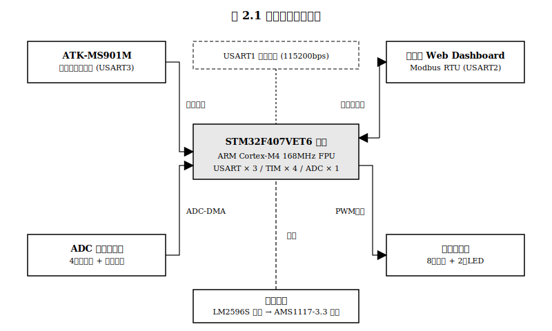

图2.1 系统硬件总体架构

系统的数据流向为：ATK-MS901M九轴姿态传感器通过UART接口将Roll、Pitch、Yaw欧拉角和陀螺仪角速度数据发送至STM32F407主控芯片；ADC模块通过DMA方式采集4路模拟信号和电压检测数据；主控芯片对采集到的传感器数据进行处理后，更新到Modbus寄存器映射表中；上位机通过Modbus RTU协议（USART2接口）读取传感器数据，并下发控制指令写入PWM控制寄存器和PWM频率寄存器；主控芯片根据寄存器中的控制值，通过定时器产生相应的PWM信号驱动舵机、电机等执行机构和LED灯板。

各子系统间通过标准接口进行连接，具体包括：通信接口方面，USART1用于系统调试输出（115200bps），USART2用于Modbus RTU通信（9600bps，8N1），USART3用于ATK-MS901M姿态传感器数据接收（115200bps）；执行器接口方面，TIM4产生CH1～CH4共4路PWM信号，TIM8产生CH5～CH6共2路PWM信号，TIM3产生CH7～CH8共2路PWM信号，TIM1产生LED1～LED2共2路PWM调光信号；传感器接口方面，ADC1通过DMA多通道采集模式获取4路模拟信号和1路电压检测信号。

## 2.2 主要硬件应用

### 2.2.1 主控芯片

本设计选用意法半导体（STMicroelectronics）推出的STM32F407VET6微控制器作为系统主控芯片。STM32F407属于STM32F4系列高性能产品线，基于ARM Cortex-M4内核架构，最高工作频率可达168MHz，具备出色的实时运算能力。

STM32F407VET6的主要技术参数如下：处理器内核为ARM Cortex-M4，支持DSP指令集和单精度硬件浮点运算单元（FPU），这使得芯片能够高效地执行姿态数据的浮点运算；片内集成512KB Flash程序存储器和192KB SRAM数据存储器，为程序运行和数据缓存提供了充足的空间；供电电压范围为1.8V～3.6V，工作温度范围为-40℃～+85℃，能够适应水下设备对环境适应性的要求。

在外设资源方面，STM32F407VET6提供了丰富的接口：多达3路USART和3路UART串行通信接口，本设计中分别用于系统调试、Modbus通信和姿态传感器数据接收；多达14个16位定时器和2个32位定时器，本设计利用TIM1、TIM3、TIM4和TIM8四个高级/通用定时器产生共10路PWM输出；3个12位ADC模数转换器，共支持24个外部采集通道，本设计使用ADC1的5个通道进行多路模拟信号采集。

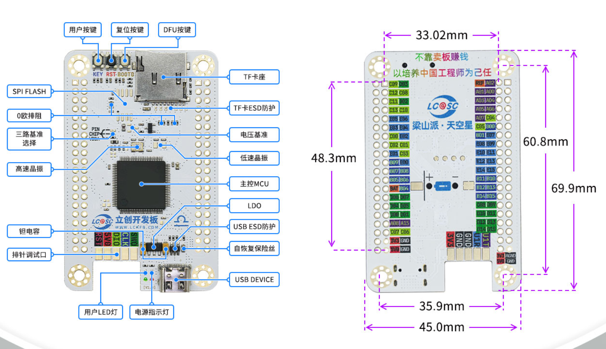

图2.2 STM32F407VET6实物图

本设计中STM32F407VET6的主控原理图如图2.3所示，展示了芯片引脚与各外设模块的连接关系。

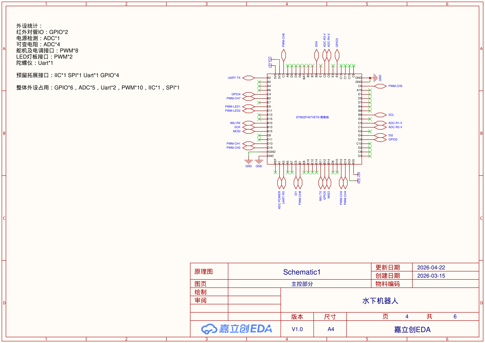

图2.3 主控部分原理图

在本设计中，STM32F407VET6的引脚分配方案如下：

（1）通信接口：PA9/PA10分配给USART1，用于系统调试串口输出，波特率115200bps；PA2/PA3分配给USART2，用于Modbus RTU从站通信，波特率9600bps，数据格式8N1；PB10/PB11分配给USART3，用于接收ATK-MS901M姿态传感器数据，波特率115200bps。

（2）PWM输出接口：PD13（TIM4_CH2）、PD14（TIM4_CH3）、PD15（TIM4_CH4）、PD12（TIM4_CH1）分配给PWM通道CH1～CH4；PC6（TIM8_CH1）、PC7（TIM8_CH2）分配给PWM通道CH5～CH6；PB0（TIM3_CH3）、PB1（TIM3_CH4）分配给PWM通道CH7～CH8；PA8（TIM1_CH1）、PA11（TIM1_CH4）分配给LED1和LED2的PWM调光输出。

（3）ADC采集接口：PA0～PA3和PA5分配给ADC1的通道0～3和通道5，分别用于4路模拟信号采集和1路电压检测。

（4）预留接口：系统预留了GPIO口用于红外对管接口和其他扩展功能。

### 2.2.2 姿态传感器 — ATK-MS901M

ATK-MS901M是正点原子推出的九轴姿态传感器模块，内部集成了三轴加速度计、三轴陀螺仪和三轴磁力计。其特点在于片内已集成卡尔曼滤波融合算法，能直接通过串口输出融合后的欧拉角（Roll、Pitch、Yaw）和四元数，无需主控芯片另行处理姿态解算，显著降低了STM32端的计算负担。

ATK-MS901M的主要技术指标包括：姿态测量范围为Roll ±180°、Pitch ±90°、Yaw 0°～360°；姿态测量精度可达静态0.05°、动态0.1°；陀螺仪量程为±2000°/s，加速度计量程为±16g；数据更新频率最高可达200Hz；通信接口为UART，支持波特率9600～921600bps，本设计中配置为115200bps。

该模块的通信协议采用帧格式传输，每帧数据由帧头（0x55）、帧ID、数据长度、有效数据和校验和五部分组成。在本设计中主要使用以下帧类型：姿态帧（帧ID为0x01），包含Roll、Pitch、Yaw三个欧拉角数据；四元数帧（帧ID为0x02），包含四元数参数；陀螺仪帧（帧ID为0x03），包含三轴角速度数据。

在本设计中，ATK-MS901M通过USART3接口与主控通信。主控芯片以非阻塞方式接收数据帧，解析出Roll、Pitch、Yaw欧拉角和GyroX、GyroY、GyroZ角速度后，以IEEE 754浮点格式写入Modbus姿态寄存器组（0x0010～0x001B）。上位机只需读取该组寄存器，即可获得实时姿态数据。姿态传感器的输出质量在很大程度上决定了后续转向控制的效果。

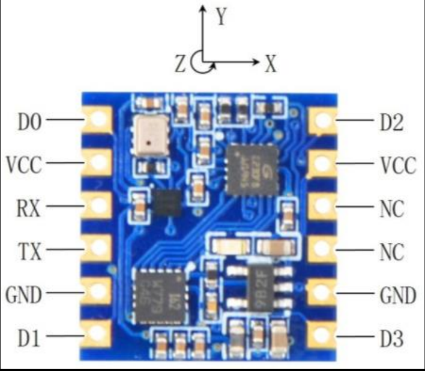

图2.4 ATK-MS901M模块实物图

IMU姿态检测模块的接口原理图如图2.5所示，模块通过USART3与主控芯片通信，供电电压为5V。

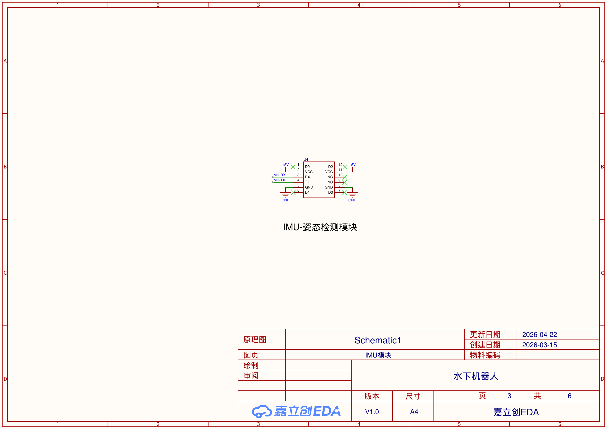

图2.5 IMU姿态检测模块原理图

### 2.2.3 执行机构 — PWM输出与LED

本系统设计了共10路PWM输出，其中8路用于驱动舵机、电机、电调等通用执行机构，2路用于LED灯板的PWM调光控制。

（1）8路通用PWM输出（CH1～CH8） 

8路PWM通道按照所属定时器分为三组：CH1～CH4由TIM4产生，CH5～CH6由TIM8产生，CH7～CH8由TIM3产生。默认配置下，各通道输出频率为50Hz（周期20ms），占空比范围为500～2500μs，这是标准舵机的控制信号规格。通过改变占空比值，可以精确控制舵机的转向角度，其中500μs对应舵机最小角度，2500μs对应最大角度，1500μs对应中位。

除舵机控制外，这8路PWM通道同样可以驱动电调（ESC）来控制无刷电机的转速，或者直接驱动有刷电机等其他类型的执行机构。系统支持通过Modbus寄存器在运行时动态调节PWM频率参数（ARR和PSC值），同组通道共享频率设置。频率计算公式为：

$$f = \frac{Timer\_CLK}{(PSC + 1) \times (ARR + 1)}$$

其中，TIM4和TIM3挂载在APB1总线上，时钟频率为84MHz；TIM8挂载在APB2总线上，时钟频率为168MHz。默认参数ARR=19999、PSC=83时，TIM4和TIM3的输出频率为84MHz÷84÷20000=50Hz。

（2）2路LED PWM调光（LED1～LED2）

LED1和LED2由TIM1产生PWM调光信号，占空比范围为0～1000，其中0表示完全关闭，1000表示最大亮度。这两路LED输出可用于水下照明灯板或状态指示灯的亮度控制，通过Modbus寄存器实现远程调光功能。

舵机与电调接口原理图如图2.6所示，每路PWM输出通道均可通过跳线帽选择+5V固定电源或VCC-ADJ可调电源为执行器供电。

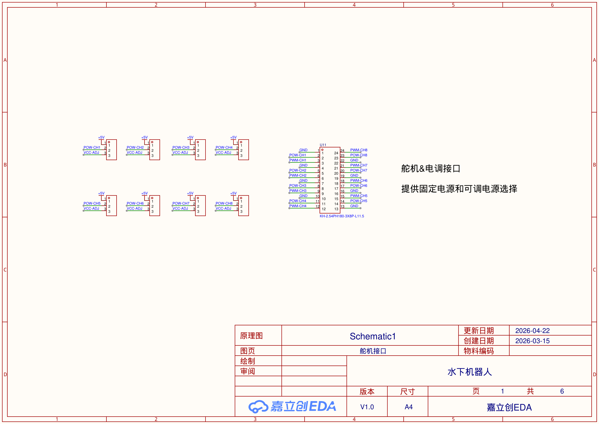

图2.6 舵机与电调接口原理图

### 2.2.4 电源系统

水下智能转向控制系统中各功能模块对供电电压的要求不同，因此需要设计合理的电源管理方案。本系统采用多级电源转换架构，电源系统原理图如图2.7所示，主要包含电源输入与滤波、LM321电压检测、LM2596S-ADJ可调降压电源、LM2596S-5.0固定5V电源和AMS1117-3.3线性稳压五个部分。

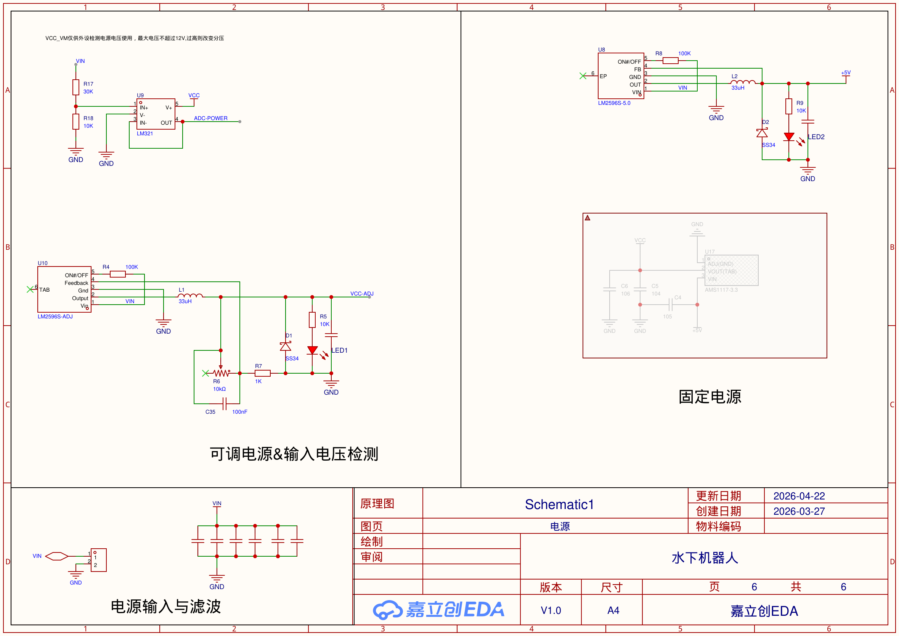

图2.7 电源系统原理图

（1）输入电压范围与电压检测。外部电源VIN经输入滤波电路后接入系统。为了实时监测电源电压，设计了基于LM321运算放大器和分压电阻网络的电压检测电路。电路采用R17（30KΩ）和R18（10KΩ）构成分压网络，将VIN按比例缩小到ADC可采集的0～3.3V范围内，经LM321缓冲后送入STM32的ADC通道。分压公式为：

$$V_{ADC} = V_{IN} \times \frac{R_{18}}{R_{17} + R_{18}} = V_{IN} \times \frac{10K}{30K + 10K} = \frac{V_{IN}}{4}$$

由ADC原始值反推实际输入电压的换算公式为：

$$V_{IN} = \frac{ADC\_RAW \times 3.3}{4096} \times 4 = \frac{ADC\_RAW \times 13.2}{4096}$$

其中，3.3为ADC参考电压（V），4096为12位ADC的量化级数，4为分压比的倒数。由此可得系统可检测的最大输入电压为：

$$V_{IN\_MAX} = 3.3V \times 4 = 13.2V$$

设计上将输入电压限制在12V以内，预留约10%的安全余量，若实际应用中电源电压超过12V，则需调整分压电阻参数。换算后的电压值以×100的整数形式写入Modbus电压寄存器供上位机查询。

（2）LM2596S-ADJ可调降压模块。LM2596是一款Buck型开关降压稳压器，输入电压范围为4.5V～40V，最大输出电流3A，内置振荡器开关频率150kHz，效率可达92%。其输出电压VCC-ADJ由Feedback引脚上的分压电阻网络决定，计算公式为：

$$V_{OUT} = V_{REF} \times \left(1 + \frac{R_2}{R_1}\right)$$

其中，$V_{REF}=1.23V$为LM2596内部基准电压，$R_2$为输出端到Feedback引脚的上臂电阻（R5=10KΩ），$R_1$为Feedback引脚到GND的下臂电阻。本设计中下臂由固定电阻R7（1KΩ）与可调电位器R6（0～10KΩ）串联构成，即$R_1 = R_7 + R_6 = 1K\Omega + (0 \sim 10K\Omega)$，因此输出电压的可调范围为：

$$V_{OUT\_MIN} = 1.23 \times \left(1 + \frac{10K}{11K}\right) \approx 2.35V$$

$$V_{OUT\_MAX} = 1.23 \times \left(1 + \frac{10K}{1K}\right) = 13.53V$$

由于系统输入电压VIN不超过12V，LM2596的输出电压不能高于输入电压，因此VCC-ADJ的实际可调范围为2.35V至VIN。通过旋转电位器R6即可将输出电压调节至舵机和电调所需的工作电压，为执行器模块提供稳定供电。

（3）LM2596S-5.0固定5V降压模块。系统另配备一路LM2596S-5.0固定输出5V电源，为ATK-MS901M姿态传感器和其他5V外设提供稳定供电。该芯片内部集成了5V基准电压反馈网络，无需外部分压电阻即可输出稳定的5V电压。

（4）AMS1117-3.3线性稳压芯片。AMS1117-3.3将5V电压进一步稳定为3.3V，供给STM32F407主控芯片等数字器件。AMS1117的压差低至1.2V，输出电流可达1A，满足主控芯片和传感器的供电需求。

### 2.2.5 ADC模拟信号采集接口

系统配备了4路通用模拟信号采集通道（ADC CH0～CH3）和1路电压检测通道，共5路ADC采集。ADC模块采用DMA（直接内存访问）多通道扫描模式，能够在不占用CPU资源的情况下自动完成多通道数据的连续采集和内存转存。

4路模拟信号输入接口可灵活接入各类模拟传感器，如温度传感器、压力传感器、深度传感器等，用于采集水下环境的物理参数。STM32F407的ADC分辨率为12位，量化范围0～4095，参考电压为3.3V，对应的电压分辨率约为0.8mV，满足一般环境参数监测的精度要求。

ADC模拟量检测接口原理图如图2.8所示，4路模拟信号经可变电阻分压后，通过LM324四运算放大器进行电压跟随缓冲，再送入STM32的ADC通道，保证信号采集的稳定性和准确性。

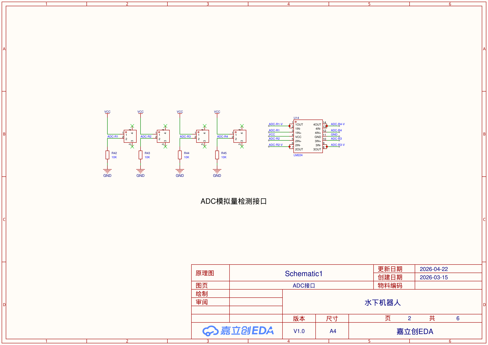

图2.8 ADC模拟量检测接口原理图

此外，系统还预留了多种扩展接口，外接设备接口原理图如图2.9所示，包括2路红外对管GPIO接口（可用于近距离障碍物检测）、LED灯板扩展接口、预留串口接口（复用为Modbus RTU通信接口）以及I2C、SPI和GPIO通用扩展接口，为后续功能扩展提供了便利。

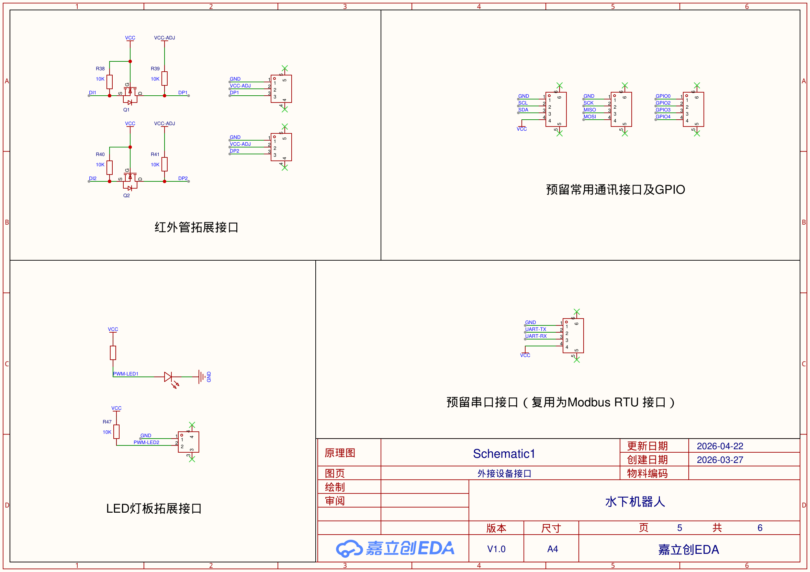

图2.9 外接设备接口原理图

## 2.3 本章小结

本章介绍了系统的硬件架构。STM32F407VET6作为主控，168MHz主频和丰富的外设接口是选择它的主要原因。姿态感知交给ATK-MS901M，它内部已完成融合解算，主控只需读取结果；执行器端配置了8路PWM和2路LED调光，占空比和频率均可在运行时动态修改；4路ADC配合电压检测电路用于环境参数和电源状态监测；电源部分由LM2596S和AMS1117分级稳压，为各模块提供对应电压。整体选型侧重性价比和可扩展性，模块间通过标准接口连接，后期替换或增加模块比较方便。

# 3 软件设计

## 3.1 系统软件总体架构设计

本系统的软件架构采用上位机-下位机协同工作模式。下位机运行在STM32F407微控制器上，负责传感器数据采集、执行器驱动和Modbus通信协议的处理；上位机运行在PC端浏览器中，通过Web Serial API与下位机进行串口通信，实现数据的可视化展示和远程控制功能。

下位机软件采用单线程主循环架构，主循环流程为：系统上电后依次完成各模块初始化（ADC、PWM、MS901M姿态传感器、Modbus从站），随后进入主循环，在每个循环周期内执行以下操作：首先以非阻塞方式（5ms超时）读取ATK-MS901M姿态传感器的欧拉角和角速度数据，并将数据写入Modbus姿态寄存器；然后调用Modbus处理函数完成ADC数据更新和Modbus协议的轮询响应；循环间隔5ms，确保系统的实时性。

上位机软件基于React前端框架开发，通过Web Serial API建立与下位机的串口连接，按照Modbus RTU协议格式构建请求帧并解析响应帧，实现寄存器的批量读取和写入。上位机以可配置的轮询间隔周期性读取系统状态、姿态数据、PWM状态、PWM频率和ADC数据五组寄存器，将数据更新到用户界面；同时接收用户的操作指令（如调节PWM占空比、设置PWM频率），通过Modbus写寄存器命令下发到下位机。

## 3.2 上位机软件设计

### 3.2.1 Web Dashboard技术选型

上位机监控软件采用现代Web前端技术栈进行开发，主要技术选型如下：

（1）React。Facebook开源的JavaScript前端框架，采用组件化的开发模式和虚拟DOM机制，能够高效地构建用户交互界面。React的状态管理和生命周期管理机制使得实时数据的显示更新变得简洁高效。

（2）Vite。新一代前端构建工具，利用浏览器原生ES Module支持实现极速的开发启动和热更新，显著提升了开发效率。

（3）TailwindCSS。原子化CSS框架，通过组合预定义的工具类实现界面样式，能够快速构建现代化、响应式的用户界面，无需编写大量自定义CSS代码。

（4）Web Serial API。W3C推出的浏览器串口通信接口，使得基于Chrome/Edge的Web应用能够直接访问本地串口设备，无需安装任何驱动程序或桌面客户端软件。这一技术选择使上位机具备了跨平台、免安装、易部署的优势。

（5）Lucide Icons。轻量级的SVG图标库，为界面提供统一风格的矢量图标。

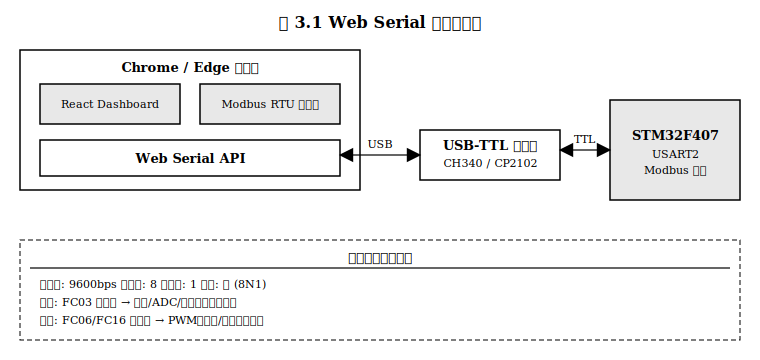

图3.1 Web Serial通信架构图

本设计未采用Qt或C#开发桌面客户端，主要原因在于浏览器方案在部署和使用上更为便捷：用户打开Chrome或Edge浏览器即可访问全部功能，无需额外安装；同时支持Windows、macOS和Linux跨平台运行；后续若需扩展为远程监控系统，只需部署至Web服务器即可，无需重新开发。不过需要指出的是，Web Serial API目前仅Chromium内核浏览器支持，Firefox和Safari尚未实现，这是该方案的一个局限性。

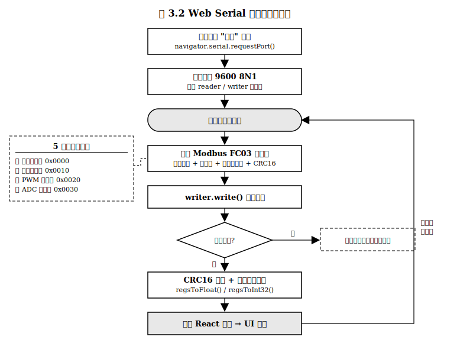

图3.2 Web Serial数据获取流程图

### 3.2.2 数据可视化界面设计

Web Dashboard的界面采用简洁的白色主题设计，以12列栅格布局组织各功能面板，主要包含以下几个区域：

（1）系统信息面板。显示设备ID、固件版本、运行模式、故障码和系统运行时间等基础信息，便于用户快速了解下位机的工作状态。

（2）姿态数据面板。以数字显示的方式展示Roll、Pitch、Yaw三个欧拉角和GyroX、GyroY、GyroZ三个角速度值，同时包含一个3D姿态可视化组件，通过CSS 3D变换模拟设备在三维空间中的姿态。

（3）ADC数据面板。以卡片式布局展示4路ADC通道的原始采集值（0～4095范围），以及经过换算的电源电压值。

（4）姿态波形面板。基于SVG实现的实时波形图，维护一个80个采样点的历史数据缓冲区，支持在欧拉角模式（Roll/Pitch/Yaw）和角速度模式（GyroX/GyroY/GyroZ）之间切换显示。波形图具备Y轴自动缩放功能，根据数据范围动态调整坐标轴。

（5）PWM控制面板。按定时器分组展示所有PWM通道，每组包含该组通道的占空比滑块控制器和频率参数（ARR/PSC）输入框。用户通过拖动滑块调节占空比（松开时写入），或输入ARR和PSC数值后点击"写入"按钮调节频率。界面实时显示根据ARR、PSC和时钟频率计算得出的实际频率值。

（6）通信日志面板。可展开/收起的日志区域，记录所有Modbus通信的收发数据帧（十六进制格式），便于开发调试。

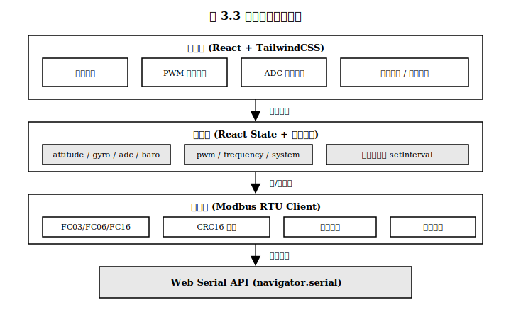

图3.3 上位机软件架构图

图3.4 数据可视化界面截图

### 3.2.3 Modbus RTU通信实现

上位机的Modbus RTU通信模块（modbus.ts）实现了完整的Modbus RTU主站协议，主要功能包括：

（1）CRC16校验。实现了标准的Modbus CRC16校验算法，预计算256元素的查找表以加速校验过程。所有发送的请求帧均自动附加CRC校验码，接收到的响应帧均进行CRC校验验证。

（2）功能码支持。实现了三种Modbus功能码：FC03（读保持寄存器）用于批量读取传感器数据和系统状态；FC06（写单个寄存器）用于设置单个PWM通道的占空比；FC16（写多个寄存器）用于同时写入ARR和PSC两个频率参数寄存器。

（3）事务队列。由于Modbus RTU是半双工协议，同一时刻只能有一个请求-响应事务在进行。通信模块内部维护了一个事务队列，所有的读写操作均通过队列串行执行，帧间间隔为15ms（大于3.5字符时间），避免了多个并发请求导致的通信冲突。

（4）超时处理。每个通信事务设置500ms的响应超时时间，超时后抛出异常，上层代码进行错误处理。

（5）浮点数转换。姿态寄存器以IEEE 754单精度浮点格式存储，占用两个相邻的16位寄存器。通信模块提供了`regsToFloat`函数，使用DataView将两个大端序的16位寄存器值还原为32位浮点数。

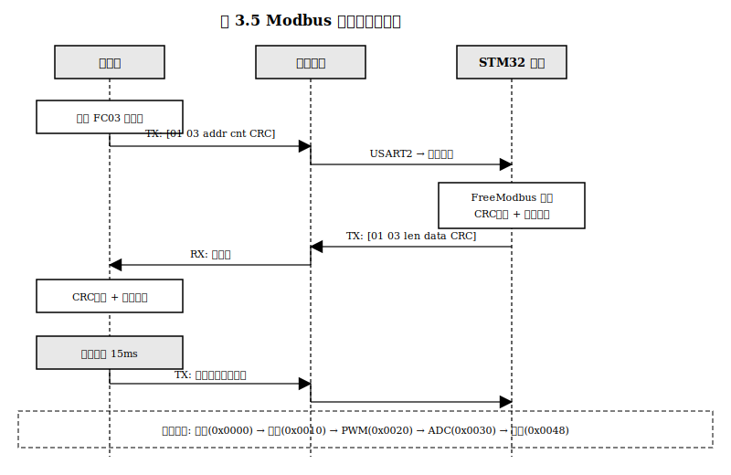

图3.5 Modbus通信逻辑流程图

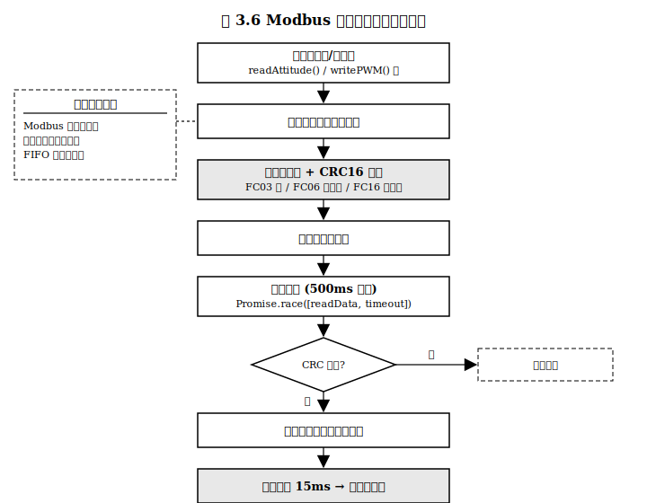

图3.6 Modbus客户端通信实现流程图

### 3.2.4 Web Serial串口通信

Web Serial API是Web Dashboard与下位机之间的物理通信桥梁。串口通信的实现流程如下：

（1）串口打开。用户点击"连接"按钮后，浏览器弹出串口选择对话框，用户选择对应的COM口。程序以指定参数打开串口：波特率9600、数据位8位、停止位1位、无校验位（8N1格式），与下位机的Modbus配置保持一致。

（2）数据读写。通过WritableStream向串口发送Modbus请求帧，通过ReadableStream异步读取响应帧。读取操作采用超时竞争机制：将数据读取Promise与定时器Promise进行Race竞争，确保在下位机无响应时不会永久阻塞。

（3）断开连接。释放读写流的锁定，关闭串口端口。断开操作包含了完善的异常处理，确保在各种异常情况下都能正确释放资源。

（4）连接状态管理。通信模块维护四种连接状态（disconnected、connecting、connected、error），状态变化通过回调函数通知上层UI组件进行界面更新。

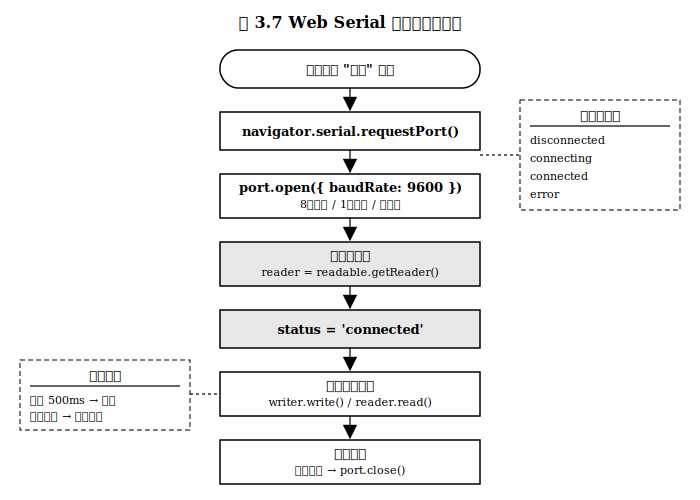

图3.7 Web Serial通信流程图

## 3.3 下位机软件设计

### 3.3.1 各模块初始化

下位机软件的初始化流程在demo_run()函数中完成，按照依赖关系依次初始化各个功能模块：

（1）系统基础初始化。由main()函数完成HAL库初始化、系统时钟配置（168MHz）、USART1调试串口初始化（115200bps），为后续模块提供基础运行环境。

（2）ADC初始化。配置ADC1的多通道DMA采集模式，开启通道0～3和通道5共5路采集，采集结果通过DMA自动存入内存缓冲区。

（3）PWM初始化。调用pwm_init(19999, 83)函数，将TIM1、TIM3、TIM4和TIM8四个定时器配置为PWM输出模式，自动重装载值ARR=19999，预分频器PSC=83，对应50Hz的默认频率。同时配置各通道对应的GPIO引脚为复用推挽输出模式。

（4）ATK-MS901M初始化。配置USART3为115200bps接收模式，通过发送查询指令验证传感器是否在线。若传感器未连接，系统打印警告信息但不阻止继续运行，确保系统的鲁棒性。

（5）Modbus从站初始化。调用modbus_init()函数，初始化FreeModbus协议栈，配置从站地址为1，通信参数为9600bps、8N1；将寄存器映射表中的系统寄存器（设备ID=0x0407、固件版本=0x0300）和PWM频率寄存器（默认ARR=19999、PSC=83）设置为初始值；启动Modbus从站，进入监听状态。

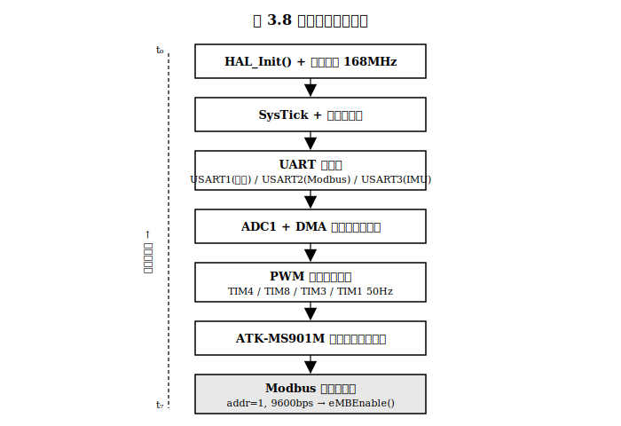

图3.8 系统初始化时序图

### 3.3.2 ATK-MS901M姿态数据采集

姿态数据的采集是主循环中的核心任务之一。ATK-MS901M传感器持续通过UART发送姿态数据帧，下位机软件在每个主循环周期中以非阻塞方式接收和解析数据。

ATK-MS901M的通信协议采用帧格式：帧头（0x55）+ 帧ID（1字节）+ 数据长度（1字节）+ 有效数据（N字节）+ 校验和（1字节）。其中校验和为帧头之后所有字节的累加和取低8位。软件层面的数据接收采用非阻塞方式，调用atk_ms901m_get_attitude()和atk_ms901m_get_gyro_accelerometer()函数时设置5ms超时参数，避免因传感器未连接或数据帧丢失导致主循环阻塞。

成功获取的姿态数据包括Roll（横滚角）、Pitch（俯仰角）、Yaw（偏航角）三个欧拉角和GyroX、GyroY、GyroZ三个轴的角速度。这些数据以IEEE 754单精度浮点格式（32位）存储，每个浮点数占用两个相邻的Modbus寄存器（高字节在前，大端字序）。通过modbus_set_register_float()函数将浮点数拆分为高16位和低16位，分别写入对应的寄存器地址（0x0010～0x001B），供上位机通过Modbus FC03命令读取。

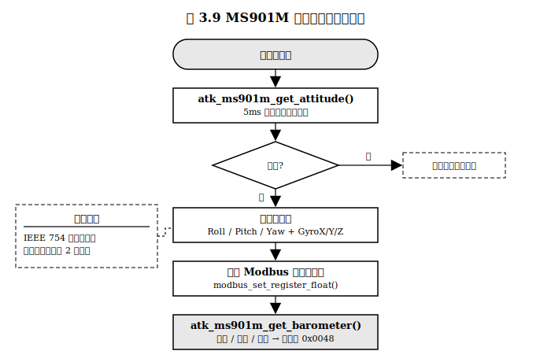

图3.9 MS901M姿态数据采集流程图

#### 卡尔曼滤波算法

尽管ATK-MS901M内部已集成卡尔曼滤波算法，但在实际调试中发现，传感器输出仍会受到电磁干扰和串口通信抖动的影响，波形上偶尔出现毛刺。因此，本设计在STM32端增加了一层一维卡尔曼滤波器，对姿态角和角速度数据进行二次平滑处理。

卡尔曼滤波的基本原理是把系统模型的预测值和传感器的实际观测值做加权融合，在噪声环境中得到一个较优的状态估计。每个采样周期分两步：先用模型预测当前状态，再用实测值修正这个预测，修正幅度由卡尔曼增益决定。

对于姿态角滤波，采用带预测模型的一维卡尔曼滤波器。以Roll轴为例，状态变量为Roll角度值，状态转移方程利用陀螺仪角速度进行预测：

$$\hat{x}_k^- = \hat{x}_{k-1} + \omega \cdot \Delta t$$

其中，$\hat{x}_k^-$为当前时刻的先验状态估计，$\hat{x}_{k-1}$为上一时刻的后验状态估计，$\omega$为陀螺仪测量的角速度（deg/s），$\Delta t$为采样时间间隔（s）。

先验误差协方差预测：

$$P_k^- = P_{k-1} + Q$$

其中，$P_k^-$为先验误差协方差，$Q$为过程噪声协方差，反映系统模型的不确定性。

卡尔曼增益计算：

$$K_k = \frac{P_k^-}{P_k^- + R}$$

其中，$R$为观测噪声协方差，反映传感器测量的不确定性。卡尔曼增益$K_k$的取值范围为[0,1]，当$R$较大时（观测噪声大），$K_k$趋近于0，滤波器更信任预测值；当$Q$较大时（过程噪声大），$K_k$趋近于1，滤波器更信任观测值。

状态更新（后验估计）：

$$\hat{x}_k = \hat{x}_k^- + K_k \cdot (z_k - \hat{x}_k^-)$$

其中，$z_k$为传感器输出的姿态角观测值，$(z_k - \hat{x}_k^-)$为观测残差（新息）。

误差协方差更新：

$$P_k = (1 - K_k) \cdot P_k^-$$

在实际实现中，本设计为6个通道分别创建独立的卡尔曼滤波器实例：Roll、Pitch、Yaw三个姿态角通道采用带陀螺仪预测的完整卡尔曼滤波模型，过程噪声$Q=0.001$，观测噪声$R=0.1$；GyroX、GyroY、GyroZ三个角速度通道采用简化的纯观测卡尔曼滤波模型（即预测步保持状态不变），过程噪声$Q=0.01$，观测噪声$R=0.05$。较小的$Q/R$比值使滤波器侧重于平滑效果，有效抑制高频噪声的同时保持了姿态数据的实时响应特性。

### 3.3.3 PWM执行器驱动

PWM驱动模块负责产生控制执行器的PWM信号，支持占空比调节和频率调节两种控制方式。

（1）定时器配置。系统使用4个定时器产生共10路PWM信号：TIM4（挂载于APB1总线，时钟84MHz）产生CH1～CH4共4路；TIM8（挂载于APB2总线，时钟168MHz）产生CH5～CH6共2路；TIM3（挂载于APB1总线，时钟84MHz）产生CH7～CH8共2路；TIM1（挂载于APB2总线，时钟168MHz）产生LED1和LED2共2路。默认配置下，ARR=19999、PSC=83（对于84MHz定时器）或PSC=167（对于168MHz定时器，此处使用统一PSC=83的初始化参数），输出频率为50Hz。

（2）占空比调节。pwm_set_duty()函数根据通道号调用__HAL_TIM_SET_COMPARE()宏设置对应定时器通道的比较值，该值直接决定PWM波形的高电平持续时间。对于舵机控制通道（CH1～CH8），占空比范围为500～2500（对应500μs～2500μs脉冲宽度）；对于LED调光通道（LED1～LED2），占空比范围为0～1000。

（3）频率调节。pwm_set_frequency()函数实现了运行时的频率动态调节功能。该函数接收定时器分组号、新的ARR值和PSC值作为参数，通过__HAL_TIM_SET_AUTORELOAD()和__HAL_TIM_SET_PRESCALER()宏修改定时器的自动重装载寄存器和预分频寄存器，最后通过设置更新事件（EGR=TIM_EGR_UG）使新参数立即生效。同一定时器组的所有通道共享频率参数，这意味着CH1～CH4始终保持相同的频率，CH5～CH6保持相同的频率，CH7～CH8保持相同的频率，LED1～LED2保持相同的频率。

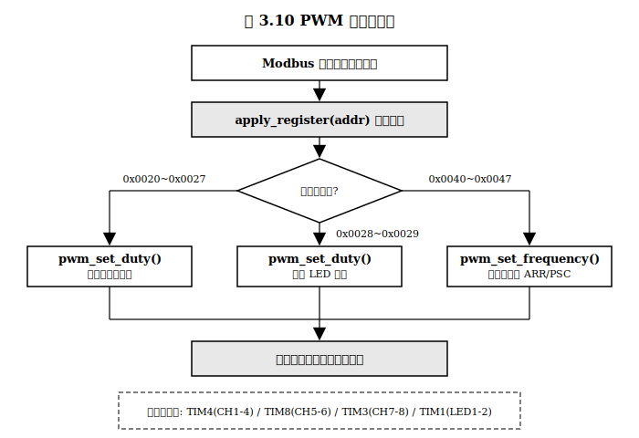

图3.10 PWM控制流程图

### 3.3.4 Modbus RTU从站协议

Modbus RTU从站协议是系统通信的核心，基于FreeModbus开源协议栈实现。FreeModbus处理底层的协议帧解析、CRC校验和功能码分发，本设计在此基础上实现了寄存器映射、读写权限控制和硬件联动机制。

（1）寄存器地址映射。系统定义了78个保持寄存器（uint16_t类型数组），按功能分为6组：

表3.1 Modbus寄存器地址映射表

| 地址范围 | 名称 | 数量 | 权限 | 说明 |
|---|---|---|---|---|
| 0x0000-0x0005 | 系统寄存器 | 6 | R/部分RW | 设备ID、固件版本、运行模式(RW)、故障码、系统时钟 |
| 0x0010-0x001B | 姿态寄存器 | 12 | R | Roll/Pitch/Yaw/GyroX/Y/Z（IEEE 754浮点，每个占2寄存器） |
| 0x0020-0x0029 | PWM控制寄存器 | 10 | RW | SERVO1-8占空比(500-2500) + LED1-2占空比(0-1000) |
| 0x0030-0x0039 | ADC传感器寄存器 | 10 | R | 4路模拟量 + 电压(×100) + 5路ADC原始值 |
| 0x0040-0x0047 | PWM频率寄存器 | 8 | RW | 4组定时器的ARR+PSC（每组2寄存器） |
| 0x0048-0x004D | 气压计寄存器 | 6 | R | 气压(int32 Pa) + 海拔(int32 cm) + 温度(float ℃) |

（2）读写权限控制。is_reg_writable()函数根据寄存器地址判断该寄存器是否允许写入。只有运行模式寄存器（0x0002）、PWM控制寄存器组（0x0020～0x0029）和PWM频率寄存器组（0x0040～0x0047）允许写入操作。对只读寄存器的写入请求，FreeModbus会返回非法数据地址异常响应。

（3）写入后自动应用。apply_register()函数在寄存器被写入后自动调用，根据寄存器地址执行相应的硬件操作：写入SERVO1～SERVO8寄存器时，调用pwm_set_duty()更新对应通道的占空比；写入LED1或LED2寄存器时，同样调用pwm_set_duty()更新LED亮度；写入ARR或PSC寄存器时，根据地址计算所属的定时器分组号，从寄存器中读取该组的ARR和PSC值，调用pwm_set_frequency()更新频率参数。

（4）周期性数据更新。modbus_process()函数在每个主循环周期中被调用，完成两项任务：将ADC DMA采集缓冲区中的最新数据搬运到对应的Modbus寄存器（包括4路模拟量、电压换算值和5路ADC原始值），以及更新系统时钟寄存器；调用eMBPoll()函数处理Modbus协议栈的待处理事件（如接收到新的请求帧）。

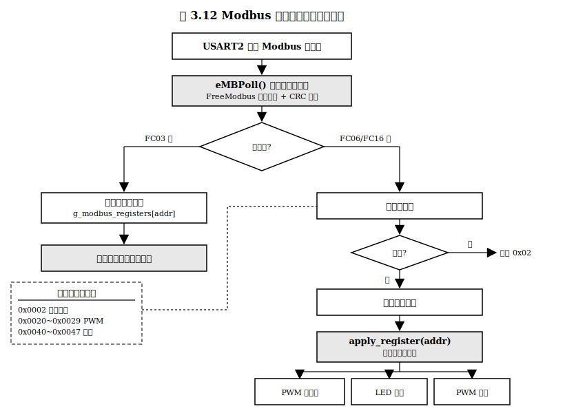

图3.11 Modbus从站寄存器回调流程图

### 3.3.5 ADC模拟数据采集

ADC模块采用DMA多通道连续采集模式，在硬件层面自动完成模拟信号的周期性采样和数据转存，不占用CPU时间。

ADC1配置为扫描模式，使能通道0～3和通道5共5个通道。DMA以循环模式运行，每次扫描完成后自动将5个通道的12位转换结果（0～4095）写入内存缓冲区。ADC的采样分辨率为12位，参考电压为3.3V，对应的最小分辨电压为3.3V÷4096≈0.8mV。

软件层面，modbus_process()函数在每个主循环周期中将DMA缓冲区的最新值更新到Modbus ADC寄存器组（0x0030～0x0039）：通道0～3的原始值直接写入ANALOG1～ANALOG4寄存器；通道4的值经过分压系数换算后写入VOLTAGE寄存器（单位：0.01V）；5个通道的原始ADC值同时写入ADC_RAW0～ADC_RAW4寄存器，供上位机直接查看原始采样数据。

这4路模拟采集通道是通用接口，实际使用时可以根据需要接入温度、压力或深度传感器等模拟输出设备，留有一定的扩展空间。

## 3.4 本章小结

本章介绍了系统的软件设计，分为上位机Web Dashboard和下位机STM32固件两部分。

上位机基于React+Vite+TailwindCSS开发，通过Web Serial API在浏览器内直接与下位机串口通信。界面上提供姿态数据可视化（数字显示、3D模型、实时波形图）、PWM占空比和频率调节、ADC数据监控以及Modbus通信日志。选择Web技术栈的好处在于用户无需安装任何客户端，Chrome或Edge浏览器即可运行全部功能。

下位机采用非阻塞主循环架构，每个周期依次完成姿态数据读取（5ms超时）、卡尔曼滤波平滑、ADC数据搬运和Modbus协议轮询。全部78个保持寄存器按功能分为6组，写入操作会自动触发对应的硬件动作（比如写PWM寄存器就立刻改变输出占空比），上位机无需关心底层硬件细节。

# 4 设备功能调试

## 4.1 概述

调试阶段的基本思路是先拆后合：先逐个验证电源、姿态传感器、Modbus通信、PWM输出等模块的独立功能，排除单点故障后再组装为完整系统做联调。这种策略在嵌入式开发中较为常见，优势在于便于故障定位。

调试环境与工具如下：下位机固件编译使用EIDE（Embedded IDE）开发环境，基于ARM Keil MDK-ARM编译器；串口调试使用串口助手软件，用于查看USART1调试输出和手动发送Modbus命令；Modbus通信调试使用专用的Modbus调试工具，验证寄存器读写的正确性；上位机功能测试通过自主开发的Web Dashboard进行，在Chrome浏览器中运行。

## 4.2 电源电压调整

电源系统是整个硬件平台的基础，各模块能否正常工作首先取决于供电电压的稳定性和准确性。因此，电源电压调整是调试的第一步。

使用DP100可编程电源设置VSET=12.00V为系统供电，实测输入电压如图4.1所示，DP100显示实际输出11.99V，系统静态电流0.070A，功耗0.84W，确认输入电压在LM2596允许的4.5V～40V范围内。

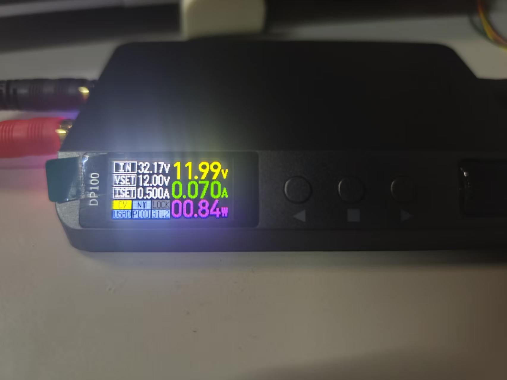

图4.1 输入电压实测（VIN=11.99V）

随后通过调节LM2596S-ADJ的电位器R6，将VCC-ADJ输出电压调节至执行器所需的工作电压。使用万用表测量VCC-ADJ输出端，实测值为9.727V，如图4.2所示。

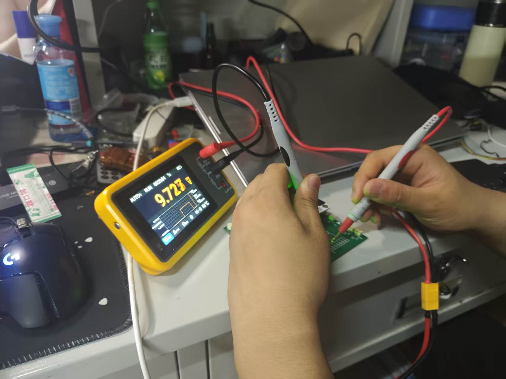

图4.2 VCC-ADJ输出电压实测（9.727V）

接着验证LM2596S-5.0固定5V输出端电压，实测值为5.2386V，如图4.3所示，略高于标称值属正常范围，能够满足ATK-MS901M姿态传感器和其他5V外设的供电需求。

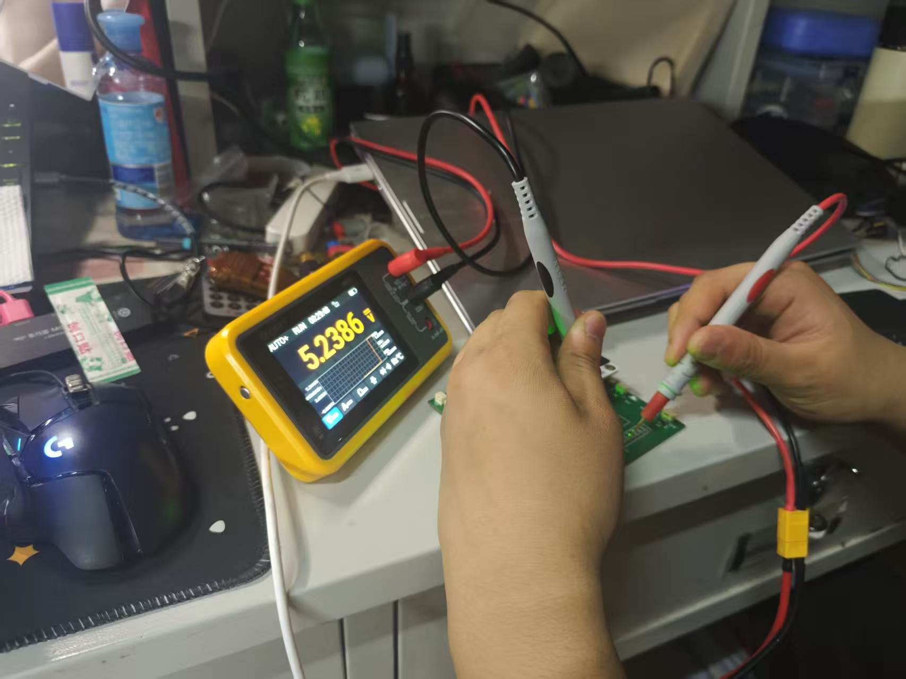

图4.3 固定5V输出电压实测（5.2386V）

AMS1117-3.3将5V电压进一步稳压为3.3V，使用万用表测量其输出端，确认输出电压在3.3V±0.05V范围内，满足STM32F407和ATK-MS901M的供电要求。实测结果表明各级电源输出稳定，满足设计要求。

## 4.3 电压检测电路验证

电压检测电路通过R17（30KΩ）和R18（10KΩ）分压后经ADC采集，软件换算公式为$V_{IN} = ADC\_RAW \times 13.2 / 4096$。在VIN=11.99V条件下，Modbus VOLTAGE寄存器读取值为1199（即11.99V×100），与万用表实测值一致，偏差在1%以内，验证了分压系数和ADC换算的正确性。

## 4.4 ATK-MS901M姿态传感器调试

姿态传感器是转向控制系统的核心感知部件，其数据的准确性和实时性直接影响系统的控制性能。调试工作主要从以下三个方面展开：

（1）串口数据帧解析验证。使用串口助手软件连接USART3，观察ATK-MS901M发送的原始数据帧，验证帧头（0x55）、帧ID、数据长度和校验和是否符合协议规范。同时在USART1调试串口上查看下位机解析后输出的姿态角数值，确认数据帧能够被正确解析。

（2）Roll/Pitch/Yaw数据精度测试。将传感器模块放置在水平面上，读取Roll和Pitch的静态零点偏移，确认其在±0.5°以内。缓慢旋转传感器模块，观察Yaw角的变化是否连续平滑，确认其动态跟踪性能。将传感器分别绕三个轴旋转已知角度（如90°），比对读数与期望值的偏差。

（3）陀螺仪数据响应速度测试。快速摆动传感器模块，观察GyroX、GyroY、GyroZ的响应是否灵敏。通过Web Dashboard的姿态波形面板，以可视化方式观察角速度数据的变化曲线，验证数据更新的实时性和平滑性。

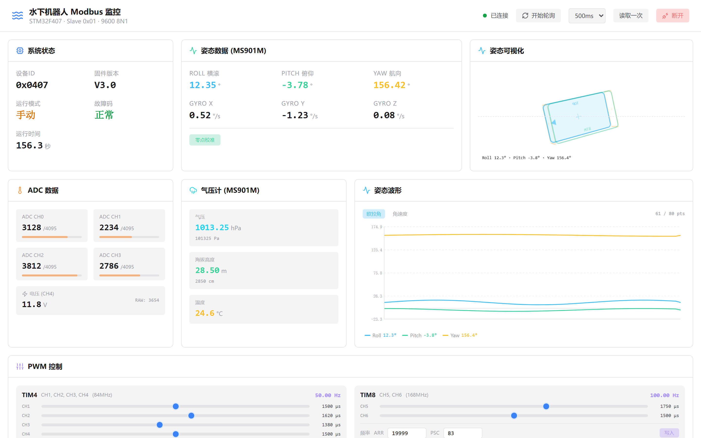

图4.4 MS901M姿态数据显示界面

## 4.5 Modbus RTU通信调试

Modbus RTU通信是上位机与下位机之间数据交互的唯一通道，其可靠性至关重要。调试过程分为以下几个步骤：

（1）使用Modbus调试工具进行基础通信测试。设置从站地址为1，波特率9600，数据格式8N1，依次发送FC03读取命令，逐组验证各寄存器的读取功能：读取系统寄存器（0x0000～0x0005），确认设备ID为0x0407、固件版本为0x0300；读取姿态寄存器（0x0010～0x001B），确认浮点数的字节序正确；读取PWM寄存器（0x0020～0x0029），确认初始占空比值；读取ADC寄存器（0x0030～0x0039），确认ADC采集数据正常；读取PWM频率寄存器（0x0040～0x0047），确认默认ARR和PSC值。

（2）寄存器写入测试。通过Modbus调试工具发送FC06命令写入PWM控制寄存器，观察对应通道的PWM输出是否发生变化；写入只读寄存器地址，确认系统返回非法数据地址的异常响应（错误码0x02）。

（3）通信稳定性测试。以500ms间隔持续轮询所有寄存器组，运行30分钟以上，统计通信超时和CRC校验错误的次数，评估通信的长期稳定性。

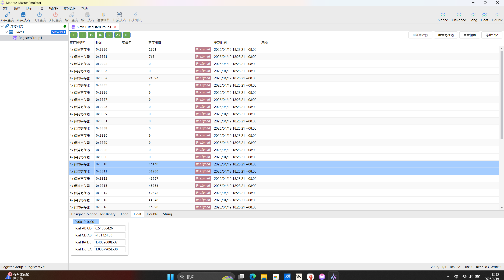

图4.5 Modbus通信调试

## 4.6 整体综合调试

各模块独立调试完成后，将全部硬件模块组装为完整系统，进行整体综合调试。综合调试的目标是验证系统各模块的协同工作能力，确认完整的控制链路（上位机操控→Modbus通信→PWM执行器响应→姿态反馈）能够正常运行。

（1）PWM输出验证。通过Web Dashboard连接下位机，依次拖动CH1～CH8的占空比滑块，观察对应通道上连接的舵机或电机是否正确响应。将占空比设置为500μs、1500μs和2500μs三个典型值，分别对应舵机的最小角度、中位和最大角度，确认执行器的运动范围正确。

（2）PWM频率调节验证。在Web Dashboard的频率设置区域，修改TIM4组的ARR和PSC参数后点击"写入"，使用示波器测量CH1～CH4的输出频率，确认频率变化与计算值一致。

（3）Web Dashboard功能完整性测试。依次验证各面板的数据显示：系统信息面板显示正确的设备ID和版本号；姿态数据面板能够实时刷新Roll/Pitch/Yaw数值；姿态波形面板的曲线实时滚动更新；ADC面板显示合理的采集值和电压值；通信日志面板正确记录收发帧数据。

（4）系统完整工作流程验证。在Web Dashboard中操控执行器（调节占空比），同时观察ATK-MS901M传感器反馈的姿态角变化，验证完整的"控制-执行-反馈"闭合链路。连续运行系统1小时以上，监测是否出现通信中断、数据异常或执行器失控等问题。

图4.6 整体调试

## 4.7 本章小结

本章按照先分后合的思路完成了系统调试。

电源部分，LM2596S和AMS1117-3.3各级输出电压稳定，实测偏差均在标称范围内；电压检测电路的ADC换算值与万用表读数的偏差不超过1%。姿态传感器部分，ATK-MS901M在静态水平面上Roll/Pitch零点偏移小于0.5度，动态旋转时Yaw跟踪平滑，陀螺仪响应灵敏。Modbus部分比较顺利，78个寄存器逐组读写均正确，只读寄存器的写入拒绝也符合预期，连续轮询30分钟未出现超时或CRC错误。

联调阶段，本文通过Web Dashboard操控舵机的同时观察姿态反馈，"操控-通信-执行-反馈"整条链路跑通后连续运行了1小时以上，未发现通信中断或执行器异常。

# 5 结论与展望

## 5.1 结论

本文围绕基于STM32F407的水下智能转向控制系统，从硬件、通信、上位机和调试四个层面完成了设计与验证。

硬件层面，以STM32F407VET6为主控，搭载ATK-MS901M九轴姿态传感器、8路PWM执行器驱动、2路LED调光、4路ADC采集和电压检测电路，电源由LM2596S和AMS1117-3.3分级供给。这套硬件方案的一个优势在于模块间通过标准接口连接，后续更换传感器或增加执行器比较方便。

通信层面，基于FreeModbus协议栈实现了Modbus RTU从站，78个保持寄存器分为6个功能组。本文在设计时特别加入了写入后自动应用到硬件的联动机制——上位机写入PWM寄存器后，对应通道的占空比会立即改变，不需要额外的触发命令。

上位机层面，用React+Vite+TailwindCSS做了一个Web Dashboard，通过Web Serial API直接在浏览器里读写串口。相比传统的Qt或C#上位机，用户无需安装任何客户端软件，打开浏览器即可使用全部功能，在实际演示和现场调试中较为便捷。

调试结果方面，各模块分别验证通过后进行了整体联调。实测数据显示：姿态静态零偏小于0.5度，Modbus通信连续轮询30分钟无超时，电压检测误差在1%以内，整条"操控-通信-执行-反馈"链路可以稳定运行1小时以上。

## 5.2 展望

目前系统实现的是开环控制框架，还有不少可以继续做的工作：

（1）加入PID姿态闭环控制算法。当前系统实现了开环控制，即上位机直接设置执行器的输出值。后续可在下位机中引入PID控制器，根据姿态传感器反馈的实时姿态角与目标姿态角的偏差，自动调节PWM输出，实现姿态的自动稳定和精确跟踪。

（2）增加深度传感器和深度控制。接入水压传感器，利用预留的ADC通道采集深度数据，结合深度PID控制器实现水下机器人的定深控制功能。

（3）扩展无线通信能力。当前系统依赖有线串口连接。后续可通过ESP32等Wi-Fi模块作为通信中继，将Modbus数据转发到Wi-Fi网络，使上位机Web Dashboard通过WebSocket实现真正的无线远程监控。

（4）搭载水下摄像头。利用预留的串口接口接入摄像头模块，实现水下视觉辅助功能，为机器人的远程操控提供直观的视觉反馈。

（5）自主导航。这是一个更长远的方向。如果后续接入GPS/声学定位模块和避障传感器，配合路径规划算法，系统有可能从当前的遥控模式逐步过渡到半自主甚至全自主作业，但这涉及的工作量较大，可作为下一阶段的研究目标。

# 致 谢

本论文的完成离不开老师、家长以及同学的帮助，在各方的帮助下我才能顺利地完成此论文。在此向所有耐心辅导我的老师、关怀我的家长以及热心帮助我的同学致以诚挚的感谢！

首先感谢学校提供的智慧化在线图书馆系统平台，让我得以浏览更多的文献来参考和丰富本论文。丰富的文献和图书库让我可以学习和了解最前沿的技术与应用，以及本专业相关技术在科研前沿的开发程度。

衷心感谢我的指导教师谢行老师，老师以其严谨的科研态度对本文的错误与不足之处进行指导修正。在老师的耐心辅导下，我得到了极大的提升，懂得了如何开启并完善一项科研研究。同时在老师对科研的热切追求下，也对我产生了深深的影响，激发了我对科研领域的追求，并促使了我选择继续深造，投身科研。在此我也要感谢郭娜老师和汪洋老师让我了解学习到嵌入式相关知识和实际应用，汪洋老师教授的C语言课程是我热爱编程的起点，也为我后期参加诸多的学科竞赛打下了坚实基础。在大学阶段的诸多成就都离不开老师的启发与辅导，由衷地感谢各位老师，希望将来我能不负众望。

衷心感谢班级同学对我大学四年工作的配合，虽说将来我们会各奔东西，但我们大学四年的同学情会一直埋存在我的心中。感谢实验室的小伙伴们，我们在一起参加学科竞赛，通宵调试代码的场景历历在目，正是与他们的这些经历让我的学科技能得以锻炼，现在我才能顺利地将本文设计顺利完成。愿将来我们都能在各自的领域发光发热！

我的成长离不开爷爷奶奶的陪伴与父母的不断鼓励，虽说他们无法给予我学术上的指导，但他们在我遇到困难时提供鼓励与支持，是我永远的力量源泉。我在完成本文工作的过程中，一直有他们的不断关怀存在，让我始终能感受到家庭的温暖。未来的我也一定不会让他们失望，我会不断地努力前进，提升自己，这样我才能给予他们无限的回报。
