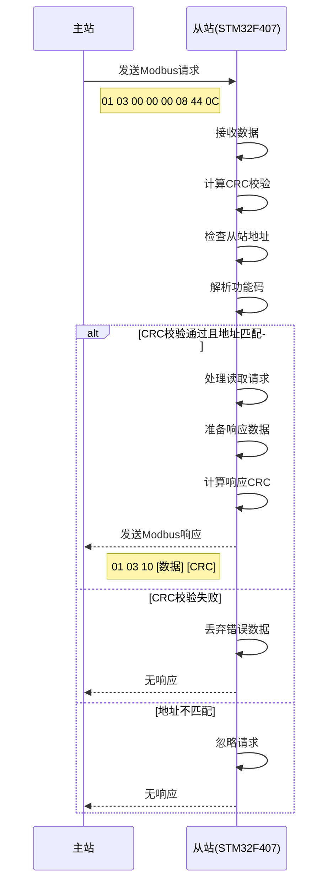

# Modbus通信流程图

## 通信流程说明

1. **请求阶段**
   - 主站发送Modbus RTU请求帧
   - 帧格式：从站地址 + 功能码 + 数据 + CRC校验
   - 示例：`01 03 00 00 00 08 44 0C`
     - 01: 从站地址
     - 03: 功能码（读取保持寄存器）
     - 00 00: 起始寄存器地址
     - 00 08: 读取寄存器数量
     - 44 0C: CRC校验

2. **接收处理**
   - 从站接收数据并存储到缓冲区
   - 检测帧结束（3.5字符时间超时）
   - 计算并验证CRC校验
   - 检查从站地址是否匹配

3. **响应阶段**
   - 解析功能码并执行相应操作
   - 准备响应数据
   - 计算响应CRC校验
   - 发送响应帧

4. **错误处理**
   - CRC校验失败：丢弃数据，无响应
   - 地址不匹配：忽略请求，无响应
   - 功能码不支持：返回异常响应
   - 数据地址无效：返回异常响应

## 通信参数

- **波特率**：9600 bps
- **数据位**：8位
- **停止位**：1位
- **校验位**：偶校验
- **接口**：USART2 (PA2-TX, PA3-RX)
- **从站地址**：0x01