# 硬件连接图

```mermaid
flowchart LR
    subgraph STM32F407[STM32F407]
        PA2[PA2 - USART2_TX]
        PA3[PA3 - USART2_RX]
        PA9[PA9 - USART1_TX]
        PA10[PA10 - USART1_RX]
        PC0[PC0 - ADC4]
        PC1[PC1 - ADC2]
        PC2[PC2 - ADC3]
        PC3[PC3 - ADC1]
        PA1[PA1 - ADCPower]
        PB12[PB12 - GPIO0]
        PE6[PE6 - GPIO2]
        PE5[PE5 - GPIO3]
        PC4[PC4 - GPIO4]
        PD13[PD13 - PWM1]
        PD15[PD15 - PWM2]
        PD12[PD12 - PWM3]
        PD14[PD14 - PWM4]
        PC6[PC6 - PWM5]
        PC7[PC7 - PWM6]
        PB0[PB0 - PWM7]
        PB1[PB1 - PWM8]
        PE9[PE9 - PWM_LED1]
        PE11[PE11 - PWM_LED2]
    end
    
    subgraph 外部设备
        Modbus[Modbus接口]
        Debug[调试串口]
        Temp1[温度传感器1]
        Temp2[温度传感器2]
        Temp3[温度传感器3]
        Temp4[温度传感器4]
        Power[电源检测]
        GPIO0[预留GPIO0]
        GPIO2[预留GPIO2]
        GPIO3[预留GPIO3]
        GPIO4[预留GPIO4]
        Servo1[舵机1]
        Servo2[舵机2]
        Servo3[舵机3]
        Servo4[舵机4]
        Servo5[舵机5]
        Servo6[舵机6]
        Servo7[舵机7]
        Servo8[舵机8]
        LED1[LED1]
        LED2[LED2]
    end
    
    PA2 --> Modbus
    PA3 --> Modbus
    PA9 --> Debug
    PA10 --> Debug
    PC0 --> Temp4
    PC1 --> Temp2
    PC2 --> Temp3
    PC3 --> Temp1
    PA1 --> Power
    PB12 --> GPIO0
    PE6 --> GPIO2
    PE5 --> GPIO3
    PC4 --> GPIO4
    PD13 --> Servo1
    PD15 --> Servo2
    PD12 --> Servo3
    PD14 --> Servo4
    PC6 --> Servo5
    PC7 --> Servo6
    PB0 --> Servo7
    PB1 --> Servo8
    PE9 --> LED1
    PE11 --> LED2
    
    style STM32F407 fill:#bfb,stroke:#333,stroke-width:2px
    style Modbus fill:#f9f,stroke:#333,stroke-width:2px
    style Debug fill:#bbf,stroke:#333,stroke-width:2px
    style Temp1 fill:#bff,stroke:#333,stroke-width:2px
    style Temp2 fill:#bff,stroke:#333,stroke-width:2px
    style Temp3 fill:#bff,stroke:#333,stroke-width:2px
    style Temp4 fill:#bff,stroke:#333,stroke-width:2px
    style Power fill:#bff,stroke:#333,stroke-width:2px
    style GPIO0 fill:#ffb,stroke:#333,stroke-width:2px
    style GPIO2 fill:#ffb,stroke:#333,stroke-width:2px
    style GPIO3 fill:#ffb,stroke:#333,stroke-width:2px
    style GPIO4 fill:#ffb,stroke:#333,stroke-width:2px
    style Servo1 fill:#fbb,stroke:#333,stroke-width:2px
    style Servo2 fill:#fbb,stroke:#333,stroke-width:2px
    style Servo3 fill:#fbb,stroke:#333,stroke-width:2px
    style Servo4 fill:#fbb,stroke:#333,stroke-width:2px
    style Servo5 fill:#fbb,stroke:#333,stroke-width:2px
    style Servo6 fill:#fbb,stroke:#333,stroke-width:2px
    style Servo7 fill:#fbb,stroke:#333,stroke-width:2px
    style Servo8 fill:#fbb,stroke:#333,stroke-width:2px
    style LED1 fill:#fbf,stroke:#333,stroke-width:2px
    style LED2 fill:#fbf,stroke:#333,stroke-width:2px
```

## 连接说明

### 通信接口
- **USART1 (PA9/PA10)**：调试串口
- **USART2 (PA2/PA3)**：Modbus通信接口

### 传感器接口
- **ADC1 (PC3)**：温度传感器1
- **ADC2 (PC1)**：温度传感器2
- **ADC3 (PC2)**：温度传感器3
- **ADC4 (PC0)**：温度传感器4
- **ADCPower (PA1)**：电源电压检测

### GPIO接口
- **GPIO0 (PB12)**：预留GPIO0
- **GPIO2 (PE6)**：预留GPIO2
- **GPIO3 (PE5)**：预留GPIO3
- **GPIO4 (PC4)**：预留GPIO4

### PWM接口
- **PWM1 (PD13)**：舵机1
- **PWM2 (PD15)**：舵机2
- **PWM3 (PD12)**：舵机3
- **PWM4 (PD14)**：舵机4
- **PWM5 (PC6)**：舵机5
- **PWM6 (PC7)**：舵机6
- **PWM7 (PB0)**：舵机7
- **PWM8 (PB1)**：舵机8
- **PWM_LED1 (PE9)**：LED1
- **PWM_LED2 (PE11)**：LED2

## 引脚分配表

| 功能 | 引脚 | 描述 |
|------|------|------|
| USART2_TX | PA2 | Modbus发送 |
| USART2_RX | PA3 | Modbus接收 |
| USART1_TX | PA9 | 调试发送 |
| USART1_RX | PA10 | 调试接收 |
| ADC1 | PC3 | 温度传感器1 |
| ADC2 | PC1 | 温度传感器2 |
| ADC3 | PC2 | 温度传感器3 |
| ADC4 | PC0 | 温度传感器4 |
| ADCPower | PA1 | 电源检测 |
| GPIO0 | PB12 | 预留GPIO0 |
| GPIO2 | PE6 | 预留GPIO2 |
| GPIO3 | PE5 | 预留GPIO3 |
| GPIO4 | PC4 | 预留GPIO4 |
| PWM1 | PD13 | 舵机1 |
| PWM2 | PD15 | 舵机2 |
| PWM3 | PD12 | 舵机3 |
| PWM4 | PD14 | 舵机4 |
| PWM5 | PC6 | 舵机5 |
| PWM6 | PC7 | 舵机6 |
| PWM7 | PB0 | 舵机7 |
| PWM8 | PB1 | 舵机8 |
| PWM_LED1 | PE9 | LED1 |
| PWM_LED2 | PE11 | LED2 |