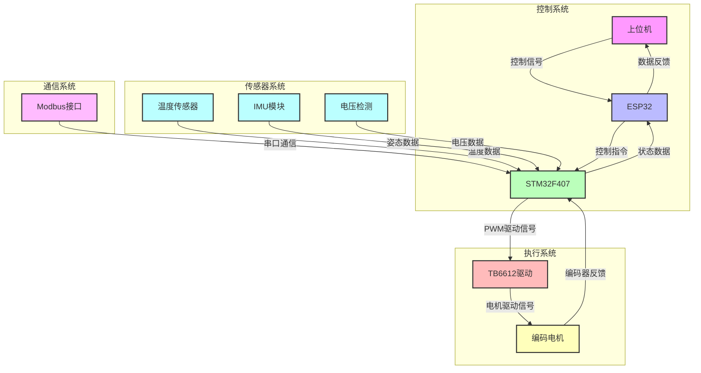

# 系统硬件架构图

## 架构说明

1. **控制系统**
   - 上位机：用户界面，发送控制指令并接收系统状态
   - ESP32：负责无线通信和数据转发
   - STM32F407：核心控制器，处理传感器数据和控制逻辑

2. **执行系统**
   - TB6612驱动：电机驱动模块
   - 编码电机：执行机构，提供动力

3. **传感器系统**
   - 温度传感器：监测系统温度
   - IMU模块：提供姿态数据
   - 电压检测：监测电源电压

4. **通信系统**
   - Modbus接口：通过USART2实现Modbus RTU通信

## 数据流向

- 上位机 → ESP32 → STM32F407：控制指令
- STM32F407 → ESP32 → 上位机：状态数据
- STM32F407 → TB6612 → 编码电机：驱动信号
- 编码电机 → STM32F407：编码器反馈
- 传感器 → STM32F407：传感器数据
- 外部设备 → Modbus接口 → STM32F407：Modbus指令
- STM32F407 → Modbus接口 → 外部设备：Modbus响应