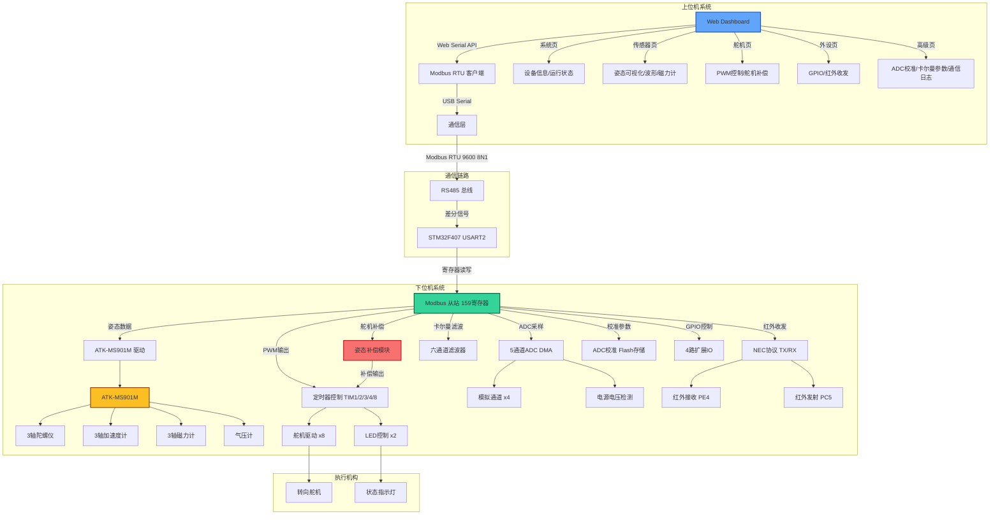
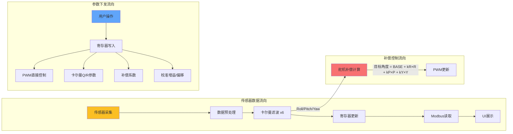
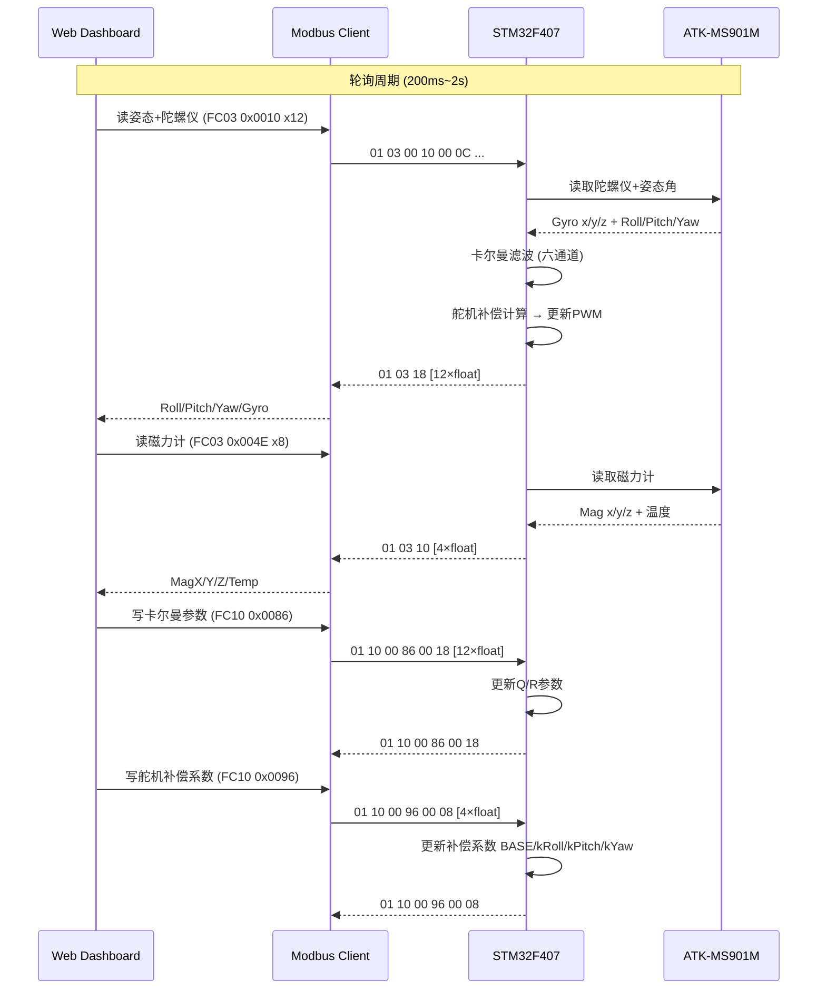
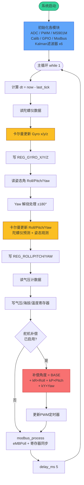
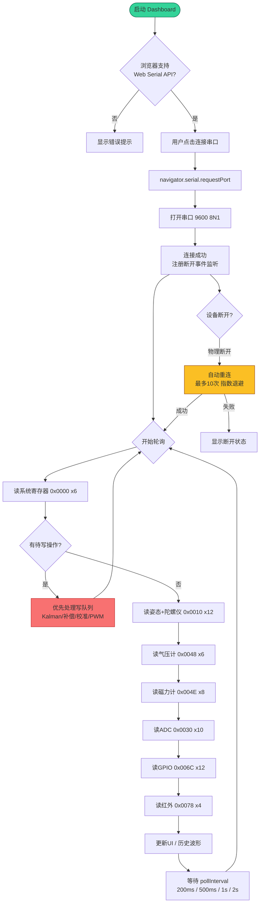

# 水下智能转向系统 - 总体架构图

## 系统架构概览

---

## 架构层次

| 层级 | 组件 | 说明 |
|------|------|------|
| **应用层** | Web Dashboard (5页) | 系统/传感器/舵机/外设/高级 |
| **协议层** | Modbus RTU | 工业标准通信协议，159个保持寄存器 |
| **驱动层** | STM32 HAL | 硬件驱动抽象层 |
| **感知层** | ATK-MS901M | 九轴姿态传感器（陀螺仪+加速度+磁力计+气压计） |
| **算法层** | 卡尔曼滤波 | 六通道滤波（Roll/Pitch/Yaw + 3轴Gyro），参数可调 |
| **补偿层** | 舵机姿态补偿 | 8路舵机独立补偿系数（BASE + kRoll/kPitch/kYaw） |
| **执行层** | 舵机/LED | 8路舵机 + 2路LED调光 |

---

## 数据流

---

## 通信时序

---

## 下位机主循环流程

---

## 上位机连接与轮询流程

---

## 硬件连接

| 设备 | 接口 | 引脚 | 说明 |
|------|------|------|------|
| ATK-MS901M | USART3 | PB10/PB11 | 九轴传感器（陀螺+加速度+磁力计+气压计） |
| Modbus通信 | USART2 | PA2/PA3 | RS485 转串口，9600 8N1 |
| 调试串口 | USART1 | PA9/PA10 | 115200 波特率 |
| 红外接收 | EXTI4 | PE4 | NEC协议解码，中断触发 |
| 红外发射 | GPIO | PC5 | NEC协议发送 |
| 舵机1-4 | TIM1 | PA8/PA9/PA10/PA11 | 50Hz PWM |
| 舵机5-8 | TIM8 | PC6/PC7/PC8/PC9 | 50Hz PWM |
| LED1-2 | TIM2 | PA15/PC10 | 调光PWM |
| ADC1-4 | ADC1 | PA0/PA1/PA2/PA3 | 模拟输入，DMA |
| 电压检测 | ADC1 | PC0 | 系统电压监测 |
| GPIO0-3 | GPIO | PB12/PE6/PE5/PC4 | 4路扩展IO |
